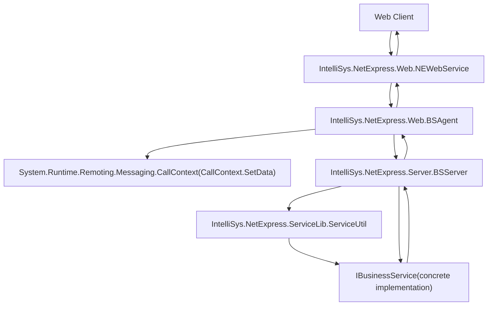
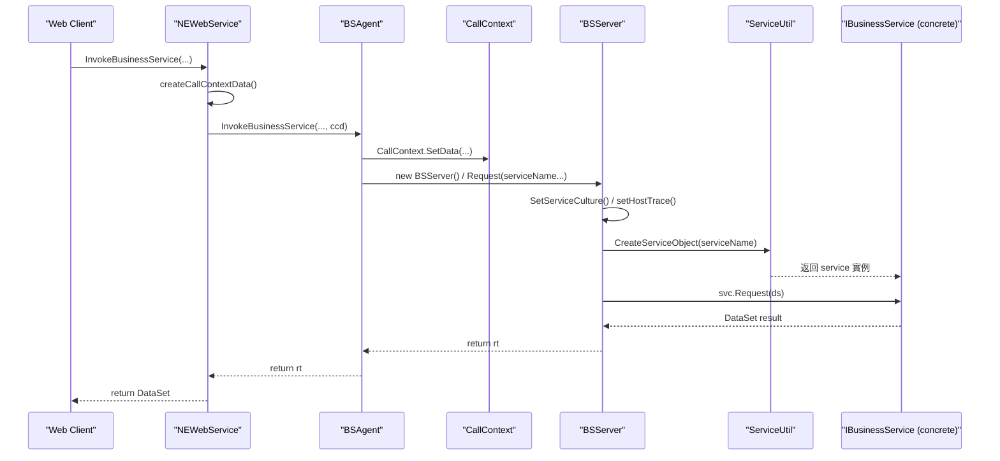
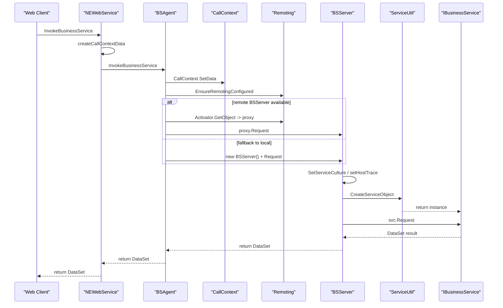
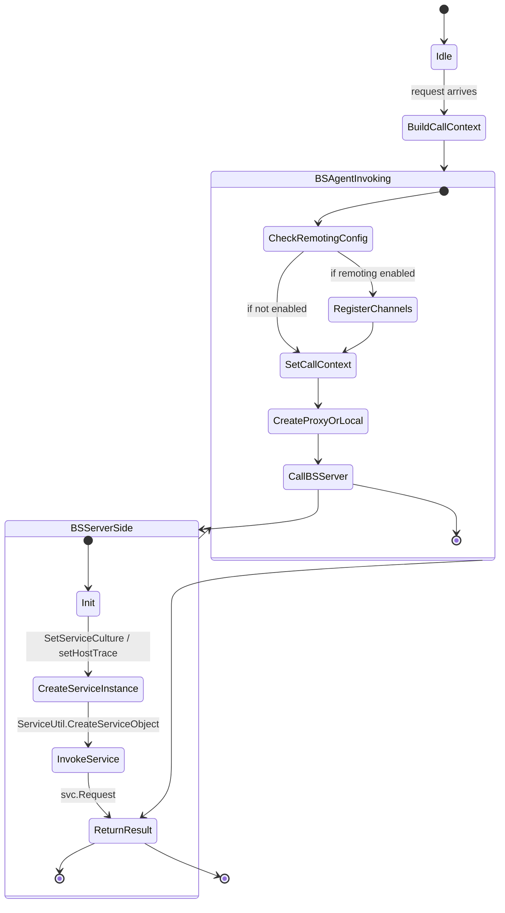

「InvokeBusinessService 呼叫後的循序圖（sequenceDiagram）」與「整體架構圖（architecture diagram）」。圖中以程式流程與主要物件為主，突顯呼叫路徑與資料回傳。
簡短說明：
•	循序圖：顯示從 InvokeBusinessService(string, DataSet) 到最終 Request(string, DataSet) 的同步呼叫流程與回傳。
•	架構圖：展示各個元件與其關係（CallContext 傳遞、BSAgent 封裝、BSServer 建立與 ServiceUtil 產生 service 實例）。

