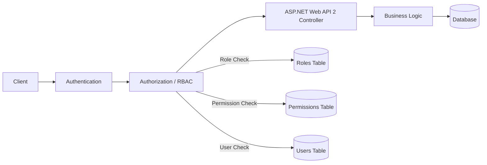
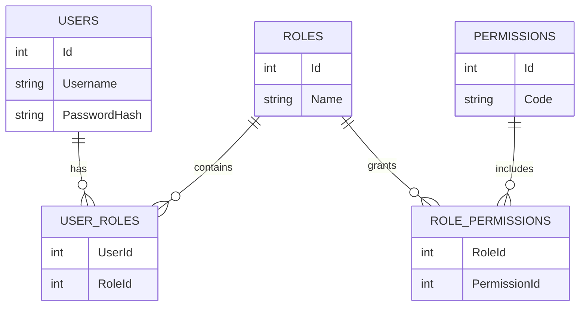
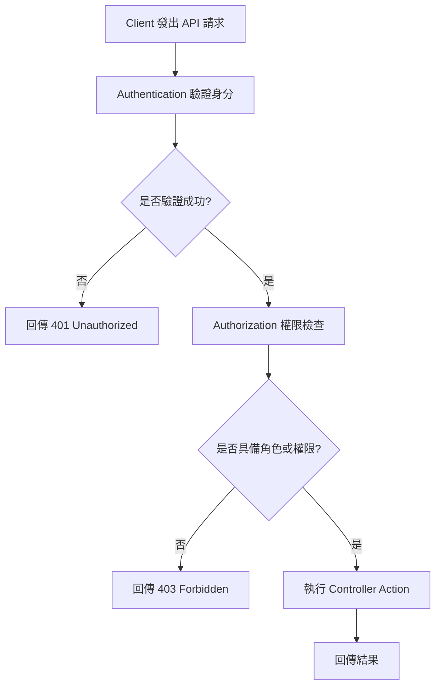

# RESTful API、HTTP 方法、ASP.NET Web API 2 與 RBAC 之關係與實作說明

## 一、前言

在現代 Web 應用程式與系統整合開發中，API 已成為前後端分離、跨系統通訊與服務整合的重要介面。  
其中，**RESTful API** 提供一種以資源為中心的設計風格，**HTTP 方法** 則是其標準操作手段；而在 .NET Framework 的應用場景中，**ASP.NET Web API 2** 常被用來實作 RESTful API。  
另一方面，當系統需要控制不同使用者對 API 的存取權限時，則可透過 **RBAC（Role-Based Access Control，角色式存取控制）** 進行授權管理。

本文將分別說明：

1. RESTful 與 HTTP 方法，以及它們與 ASP.NET Web API 2 的關係  
2. HTTP 方法與 RBAC 的關係  
3. 如何在 .NET Framework 的 ASP.NET Web API 2 中實作 RBAC  
4. 相關架構圖、流程圖與範例程式

---

## 二、RESTful、HTTP 方法與 ASP.NET Web API 2 的關係

### 2.1 RESTful 是什麼

RESTful 是一種 API 設計風格，核心概念為「**資源導向**」。  
在 RESTful 設計中，系統中的資料會被視為資源（Resource），並透過 URI（Uniform Resource Identifier）來表示，例如：

- `/users`：使用者集合
- `/users/123`：ID 為 123 的使用者
- `/orders/456`：ID 為 456 的訂單

RESTful 設計通常遵循以下原則：

- 以資源為中心
- 使用標準 HTTP 方法操作資源
- 透過 HTTP 狀態碼回應結果
- 服務端應盡量維持無狀態（Stateless）

---

### 2.2 HTTP 方法的角色

HTTP 方法是 RESTful API 的操作語言，常見對應如下：

| HTTP 方法 | 說明 | RESTful 常見用途 |
|---|---|---|
| GET | 讀取資料 | 查詢資源 |
| POST | 建立資料 | 新增資源 |
| PUT | 完整更新 | 更新整筆資源 |
| PATCH | 部分更新 | 更新部分欄位 |
| DELETE | 刪除資料 | 刪除資源 |

透過上述方法，API 可明確表達對資源的操作意圖。

---

### 2.3 ASP.NET Web API 2 的角色

ASP.NET Web API 2 是 .NET Framework 提供的 Web API 開發框架，主要用於建立 HTTP-based API。  
它與 RESTful 的關係可理解如下：

- **RESTful**：一種設計風格
- **HTTP 方法**：RESTful 的操作方式
- **ASP.NET Web API 2**：實作 RESTful API 的工具與框架

換言之，開發者可透過 ASP.NET Web API 2 建立符合 RESTful 原則的 API，並使用 HTTP 方法對資源進行操作。

---

### 2.4 架構圖

```mermaid
flowchart LR
    Client[Client / Frontend / Mobile App] -->|HTTP Request| WebAPI[ASP.NET Web API 2]
    WebAPI -->|GET /users| Read[讀取資源]
    WebAPI -->|POST /users| Create[建立資源]
    WebAPI -->|PUT /users/{id}| Update[更新資源]
    WebAPI -->|DELETE /users/{id}| Delete[刪除資源]
```

---

## 三、HTTP 方法與 RBAC 的關係

### 3.1 RBAC 是什麼

RBAC（Role-Based Access Control）是一種以角色為基礎的存取控制模型。  
其核心概念為：

- 使用者（User）被指派至某些角色（Role）
- 角色決定可執行哪些操作
- 系統根據角色判斷是否允許存取資源或執行動作

常見角色例如：

- `Admin`：具備完整管理權限
- `Editor`：可新增與修改資料
- `Reader`：僅可讀取資料

---

### 3.2 HTTP 方法與權限控制的關聯

HTTP 方法本身不是權限系統，但在實務上常與 RBAC 搭配使用，作為權限切分的依據。  
例如：

- `GET` 對應「讀取」
- `POST` 對應「新增」
- `PUT` / `PATCH` 對應「修改」
- `DELETE` 對應「刪除」

藉由角色與 HTTP 方法的對應，可設計出清楚的授權規則。

### 3.3 權限對應範例

| 角色 | GET | POST | PUT | DELETE |
|---|---:|---:|---:|---:|
| Admin | ✅ | ✅ | ✅ | ✅ |
| Editor | ✅ | ✅ | ✅ | ❌ |
| Reader | ✅ | ❌ | ❌ | ❌ |

---

### 3.4 關係說明

HTTP 方法與 RBAC 的關係可視為：

- **HTTP 方法**：描述「要做什麼」
- **RBAC**：決定「誰可以做」

因此，RBAC 通常會根據 API 的 HTTP 方法與資源類型，定義不同角色可執行的操作。

---

### 3.5 流程圖

```mermaid
flowchart TD
    User[使用者] --> Role[角色：Admin / Editor / Reader]
    Role --> Permission[權限判斷]
    Permission --> GET[GET /resources]
    Permission --> POST[POST /resources]
    Permission --> PUT[PUT /resources/{id}]
    Permission --> DELETE[DELETE /resources/{id}]
```

---

## 四、如何在 ASP.NET Web API 2 實作 RBAC

### 4.1 實作思路

在 ASP.NET Web API 2 中，RBAC 通常會放在 **Authorization（授權）** 階段處理。  
基本流程如下：

1. 使用者送出 API 請求
2. 系統先進行身份驗證（Authentication）
3. 驗證成功後，進入授權（Authorization）
4. 根據角色或權限判斷是否允許執行該 API
5. 若通過則執行 Controller Action，否則回傳 `401 Unauthorized` 或 `403 Forbidden`

---

### 4.2 架構圖



---

### 4.3 最簡單實作：使用 `[Authorize(Roles = "...")]`

ASP.NET Web API 2 內建 `AuthorizeAttribute`，可直接依角色限制 API 存取。

#### 範例：僅 Admin 可存取

```csharp name=UsersController.cs
using System.Web.Http;

[Authorize(Roles = "Admin")]
public class UsersController : ApiController
{
    [HttpGet]
    public IHttpActionResult Get()
    {
        return Ok("Only Admin can access this endpoint.");
    }
}
```

此方式適合：
- 權限需求較單純的系統
- 角色數量不多
- 不需要細緻到單一功能權限的情境

---

### 4.4 依 HTTP 方法設定角色權限

若不同 HTTP 方法需對應不同角色，可在各 Action 上加入不同的授權條件。

```csharp name=ProductsController.cs
using System.Web.Http;

public class ProductsController : ApiController
{
    [Authorize(Roles = "Admin,Editor,Reader")]
    [HttpGet]
    public IHttpActionResult GetAll()
    {
        return Ok("Anyone with read permission can access.");
    }

    [Authorize(Roles = "Admin,Editor")]
    [HttpPost]
    public IHttpActionResult CreateProduct()
    {
        return Ok("Admin or Editor can create.");
    }

    [Authorize(Roles = "Admin,Editor")]
    [HttpPut]
    public IHttpActionResult UpdateProduct(int id)
    {
        return Ok("Admin or Editor can update.");
    }

    [Authorize(Roles = "Admin")]
    [HttpDelete]
    public IHttpActionResult DeleteProduct(int id)
    {
        return Ok("Only Admin can delete.");
    }
}
```

---

### 4.5 更完整的 RBAC：角色與權限分離

若系統規模較大，建議將「角色」與「權限」分開設計，透過資料表管理角色與功能權限的對應關係。

#### 常見資料表設計

- `Users`
- `Roles`
- `Permissions`
- `UserRoles`
- `RolePermissions`

#### ER 圖



---

### 4.6 自訂 Authorization Filter

若希望以「權限」為單位控制 API，可自訂授權 Attribute。

#### 範例：PermissionAuthorizeAttribute

```csharp name=PermissionAuthorizeAttribute.cs
using System;
using System.Linq;
using System.Net;
using System.Net.Http;
using System.Security.Claims;
using System.Threading.Tasks;
using System.Web.Http.Controllers;
using System.Web.Http.Filters;

public class PermissionAuthorizeAttribute : AuthorizationFilterAttribute
{
    private readonly string[] _permissions;

    public PermissionAuthorizeAttribute(params string[] permissions)
    {
        _permissions = permissions;
    }

    public override Task OnAuthorizationAsync(
        HttpActionContext actionContext,
        System.Threading.CancellationToken cancellationToken)
    {
        var principal = actionContext.RequestContext.Principal as ClaimsPrincipal;

        if (principal == null || !principal.Identity.IsAuthenticated)
        {
            actionContext.Response = actionContext.Request.CreateResponse(
                HttpStatusCode.Unauthorized,
                "Unauthorized");
            return Task.CompletedTask;
        }

        var userPermissions = principal.Claims
            .Where(c => c.Type == "permission")
            .Select(c => c.Value)
            .ToList();

        bool allowed = _permissions.Any(p => userPermissions.Contains(p));

        if (!allowed)
        {
            actionContext.Response = actionContext.Request.CreateResponse(
                HttpStatusCode.Forbidden,
                "Forbidden");
        }

        return Task.CompletedTask;
    }
}
```

---

### 4.7 使用自訂 Attribute 的範例

```csharp name=OrdersController.cs
using System.Web.Http;

public class OrdersController : ApiController
{
    [HttpGet]
    [PermissionAuthorize("Order.Read")]
    public IHttpActionResult GetOrders()
    {
        return Ok("Order list");
    }

    [HttpPost]
    [PermissionAuthorize("Order.Create")]
    public IHttpActionResult CreateOrder()
    {
        return Ok("Order created");
    }

    [HttpDelete]
    [PermissionAuthorize("Order.Delete")]
    public IHttpActionResult DeleteOrder(int id)
    {
        return Ok("Order deleted");
    }
}
```

---

### 4.8 RBAC 驗證流程圖



---

## 五、實作建議

### 5.1 小型系統
若系統規模較小，且角色數量有限，可直接使用：

- `[Authorize(Roles = "...")]`

此方式簡單、直觀，適合快速開發。

---

### 5.2 中型系統
若系統具有較多 API 與角色，建議：

- 使用 `Claims` 存放角色與權限
- 建立自訂 `Authorization Filter`
- 將權限名稱統一規範，例如：
  - `User.Read`
  - `User.Create`
  - `User.Update`
  - `User.Delete`

---

### 5.3 大型系統
若系統需支援：

- 多租戶
- 部門層級授權
- 資料擁有者限制
- 條件式存取控制

則建議結合：

- RBAC
- ABAC（Attribute-Based Access Control）
- Resource-based Authorization

---

## 六、登入後建立 Claims 的範例

以下示範如何將角色與權限放入 Claims。

```csharp name=ClaimsExample.cs
using System.Collections.Generic;
using System.Security.Claims;

public static class ClaimsFactory
{
    public static ClaimsPrincipal CreatePrincipal(
        string username,
        IEnumerable<string> roles,
        IEnumerable<string> permissions)
    {
        var identity = new ClaimsIdentity("CustomAuth");

        identity.AddClaim(new Claim(ClaimTypes.Name, username));

        foreach (var role in roles)
        {
            identity.AddClaim(new Claim(ClaimTypes.Role, role));
        }

        foreach (var permission in permissions)
        {
            identity.AddClaim(new Claim("permission", permission));
        }

        return new ClaimsPrincipal(identity);
    }
}
```

---

## 七、整體結論

RESTful、HTTP 方法、ASP.NET Web API 2 與 RBAC 之間的關係可整理如下：

1. **RESTful** 是 API 的設計風格，強調資源導向  
2. **HTTP 方法** 是 RESTful API 中用來描述操作行為的標準方式  
3. **ASP.NET Web API 2** 是在 .NET Framework 中實作 RESTful API 的框架  
4. **RBAC** 是一種授權機制，用來控制不同角色對 API 的存取權限  
5. 在 ASP.NET Web API 2 中，RBAC 可透過 `[Authorize]` 或自訂授權 Filter 實作  
6. HTTP 方法常與 RBAC 搭配，用於區分讀取、建立、更新與刪除等操作

---

## 八、參考用對照表

| 名稱 | 角色 |
|---|---|
| RESTful | API 設計風格 |
| HTTP 方法 | 資源操作方式 |
| ASP.NET Web API 2 | API 實作框架 |
| RBAC | 存取控制模型 |
| Claims | 身分與權限資訊載體 |
| Authorization Filter | 自訂授權檢查機制 |
```  

如果你要，我也可以下一步直接幫你補成 **「真的完整 README.md」** 版本，包含：

- 封面式標題
- 摘要
- 關鍵字
- 目錄
- 參考文獻

這樣會更像正式報告。