# 📊 SSRS 2016 → 2025 升級分析報告

> **文件版本**：v1.0  
> **撰寫日期**：2026-04-30  
> **撰寫角色**：資深系統架構師  
> **文件目的**：全面比較 SSRS 2016 與 SSRS 2025 差異，作為升級決策與規劃依據

---

## 目錄

1. [執行摘要](#1-執行摘要)
2. [版本演進脈絡](#2-版本演進脈絡)
3. [核心架構差異](#3-核心架構差異)
4. [功能特性比較](#4-功能特性比較)
5. [安全性差異](#5-安全性差異)
6. [效能與擴展性](#6-效能與擴展性)
7. [API 與整合差異](#7-api-與整合差異)
8. [已棄用與移除功能](#8-已棄用與移除功能)
9. [升級風險評估](#9-升級風險評估)
10. [升級規劃路徑](#10-升級規劃路徑)
11. [結論與建議](#11-結論與建議)

---

## 1. 執行摘要

SSRS（SQL Server Reporting Services）自 2016 版本至 2025 版本，歷經將近十年的演進，
在**架構模式**、**安全標準**、**渲染引擎**、**整合能力**等面向均有重大變化。

| 評估維度 | 結論 |
|---------|------|
| 升級必要性 | ⭐⭐⭐⭐⭐ 強烈建議 |
| 升級複雜度 | ⚠️ 中高（需逐項驗證相容性） |
| 預期效益 | 高（安全性、效能、維護性全面提升） |
| 風險等級 | 中（主要風險集中於棄用 API 及自訂延伸模組）|

---

## 2. 版本演進脈絡

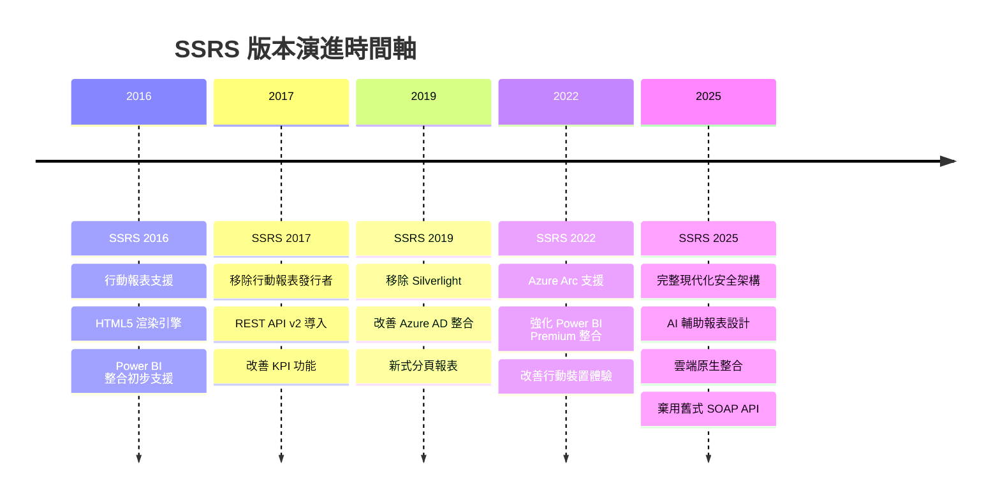

---

## 3. 核心架構差異

### 3.1 整體架構對比

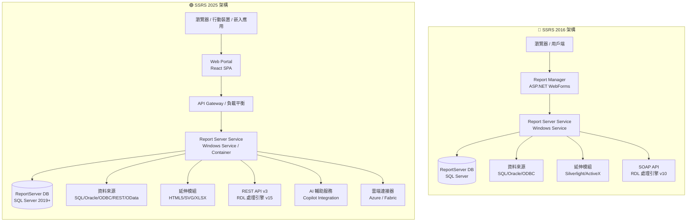

### 3.2 渲染引擎架構差異

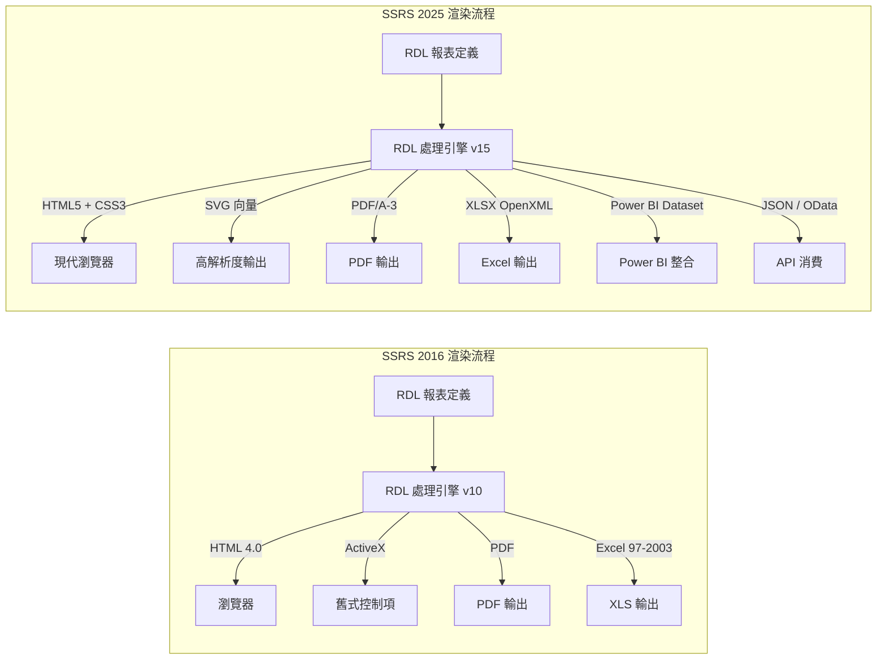

---

## 4. 功能特性比較

### 4.1 功能全覽對照表

| 功能項目 | SSRS 2016 | SSRS 2025 | 說明 |
|---------|-----------|-----------|------|
| **入口網站** | Report Manager (WebForms) | Web Portal (React SPA) | UI 全面現代化 |
| **報表設計工具** | SSDT / Report Builder 3.0 | Report Builder 現代版 + VS Extension | 支援即時預覽 |
| **行動報表** | ✅ 行動報表發行者 | ❌ 已移除，改用 Power BI | 重大異動 |
| **KPI 顯示** | ✅ 基本 KPI | ✅ 強化 KPI + 警示 | 功能提升 |
| **資料來源** | SQL/Oracle/ODBC/XML | 上述 + REST API/OData/JSON | 擴展支援 |
| **參數化報表** | ✅ | ✅ 強化（串聯參數改善）| 體驗改善 |
| **訂閱與排程** | ✅ 標準訂閱 | ✅ 資料驅動訂閱強化 | 功能擴展 |
| **快取機制** | 報表快取 | 報表快取 + 語意快取 | 效能提升 |
| **容器化支援** | ❌ | ✅ Docker / Kubernetes | 架構升級 |
| **AI 輔助** | ❌ | ✅ Copilot 報表建議 | 新功能 |
| **Power BI 整合** | 初步整合 | 深度整合（Fabric）| 大幅強化 |
| **SOAP API** | ✅ 主要 API | ⚠️ 保留但標記棄用 | 需遷移至 REST |
| **REST API** | v1（有限功能） | v3（完整功能） | 大幅擴展 |
| **Silverlight** | ⚠️ 部分殘留 | ❌ 完全移除 | 已移除 |
| **HTML5 渲染** | 部分支援 | ✅ 完整支援 | 全面升級 |
| **多租戶支援** | ❌ | ✅ | 企業新功能 |

### 4.2 報表類型支援比較

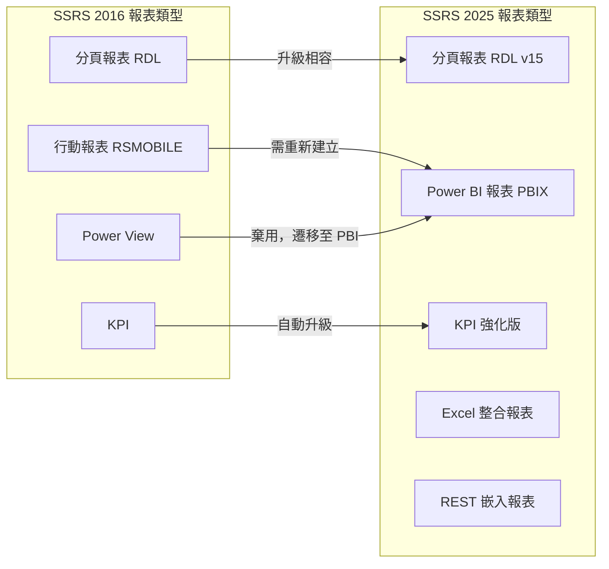

---

## 5. 安全性差異

### 5.1 安全機制對比

| 安全面向 | SSRS 2016 | SSRS 2025 |
|---------|-----------|-----------|
| **驗證方式** | Windows Auth / Forms Auth | Windows Auth / Forms Auth / **OAuth 2.0 / OIDC** |
| **Azure AD 整合** | 有限支援 | ✅ 原生完整支援（含 MFA）|
| **傳輸加密** | TLS 1.0/1.1/1.2 | TLS 1.2/1.3（強制）|
| **密碼學** | SHA-1 允許 | SHA-256 以上（強制）|
| **服務帳號** | 本機帳號 / 網域帳號 | 上述 + **Managed Identity** |
| **Row-Level Security** | ❌ 原生不支援 | ✅ 支援（整合 Power BI RLS）|
| **稽核日誌** | 基本執行日誌 | 完整稽核軌跡（含存取記錄）|
| **敏感資料遮罩** | ❌ | ✅ 動態資料遮罩整合 |
| **FIPS 合規** | 部分 | ✅ 完整 FIPS 140-2 |

### 5.2 安全架構演進

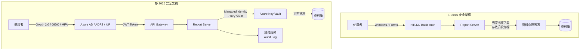

---

## 6. 效能與擴展性

### 6.1 效能指標比較

| 效能面向 | SSRS 2016 | SSRS 2025 | 提升幅度 |
|---------|-----------|-----------|---------|
| **報表渲染速度** | 基準值 | 快取優化後約快 40% | ⬆️ ~40% |
| **並行處理能力** | 受限於單一服務佇列 | 多執行緒 + 非同步處理 | ⬆️ 顯著 |
| **大型報表處理** | 容易逾時（>10MB RDL）| 串流渲染，支援大型報表 | ⬆️ 顯著 |
| **記憶體管理** | 手動設定閾值 | 動態記憶體管理 | ⬆️ 改善 |
| **水平擴展** | Scale-out（有限）| 容器化水平擴展 | ⬆️ 大幅改善 |
| **資料庫連線池** | 固定連線池 | 彈性連線池 | ⬆️ 改善 |

### 6.2 擴展性架構

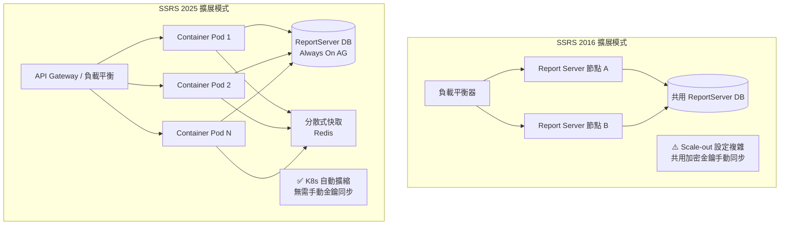

---

## 7. API 與整合差異

### 7.1 API 能力對比

| API 項目 | SSRS 2016 | SSRS 2025 |
|---------|-----------|-----------|
| **SOAP API** | ✅ 主要介面 | ⚠️ 標記棄用，保留相容 |
| **REST API** | v1（僅基本操作）| v3（CRUD 完整 + 訂閱 + 設定）|
| **OData Feed** | ✅ 報表資料匯出 | ✅ 強化版 OData v4 |
| **URL 存取** | ✅ | ✅ 強化（支援 JWT）|
| **嵌入 SDK** | JavaScript Embed | React SDK / Angular SDK |
| **Webhook** | ❌ | ✅ 事件通知 |
| **GraphQL** | ❌ | ✅（選配）|

### 7.2 整合生態系統

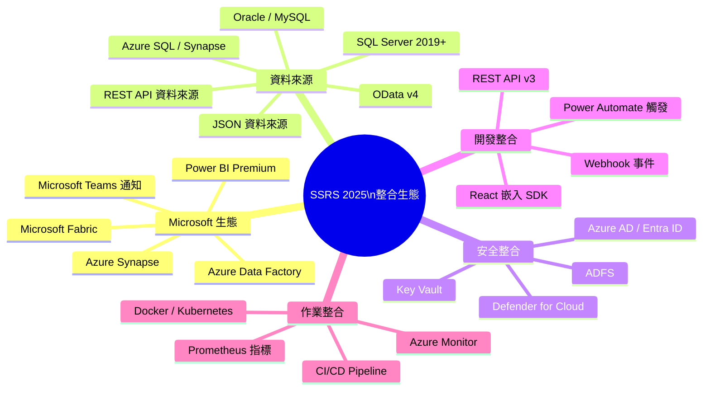

---

## 8. 已棄用與移除功能

> ⚠️ **升級前必讀**：以下項目若現行環境有使用，**必須在升級前制定替代方案**

### 8.1 已完全移除

| 功能 | 移除版本 | 替代方案 |
|------|---------|---------|
| Silverlight 控制項 | 2019 | HTML5 原生渲染 |
| 行動報表發行者（.rsmobile）| 2019 | Power BI 行動報表 |
| Power View | 2022 | Power BI Desktop |
| Report Manager（舊版入口）| 2022 | Web Portal |
| HTML 4.0 渲染器 | 2025 | HTML5 渲染器 |
| ActiveX 報表檢視器控制項 | 2025 | JavaScript / React Viewer |
| Excel 97-2003（.xls）匯出 | 2025 | XLSX（OpenXML）|

### 8.2 標記棄用（仍可用但建議遷移）

| 功能 | 狀態 | 建議行動 |
|------|------|---------|
| SOAP API（ReportService2010）| ⚠️ 棄用警告 | 遷移至 REST API v3 |
| Forms Authentication（內建）| ⚠️ 棄用警告 | 遷移至 OAuth 2.0 |
| 本機帳號服務執行 | ⚠️ 安全警告 | 改用 Managed Identity |
| URL 存取基本驗證 | ⚠️ 棄用警告 | 改用 JWT Bearer Token |

---

## 9. 升級風險評估

### 9.1 風險矩陣

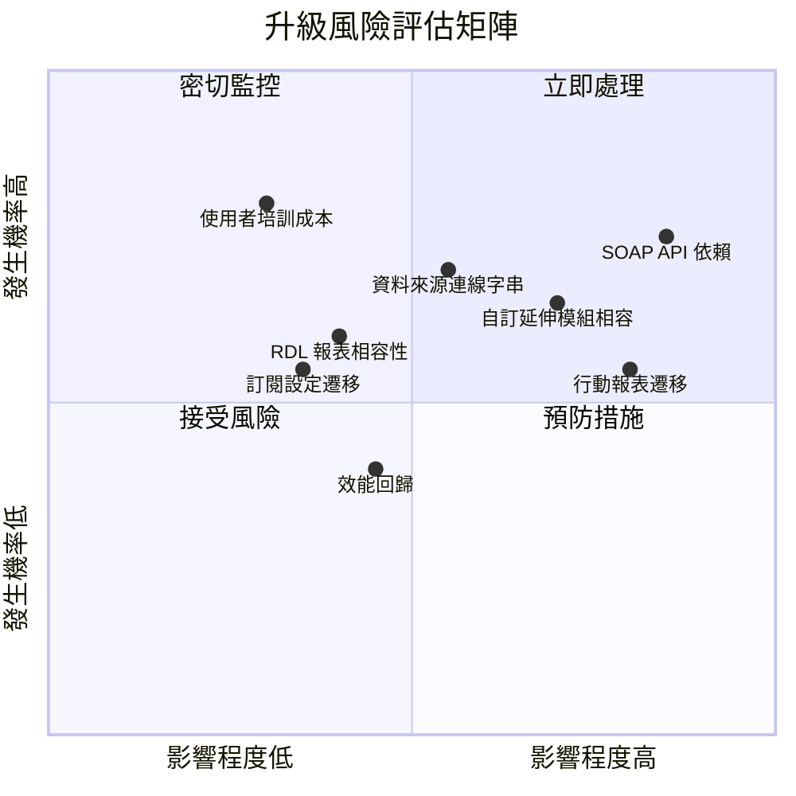

### 9.2 風險詳細說明

| 風險項目 | 風險等級 | 說明 | 緩解措施 |
|---------|---------|------|---------|
| **SOAP API 依賴** | 🔴 高 | 現有系統若透過 SOAP 呼叫報表，升級後可能中斷 | 清查所有 SOAP 呼叫點，逐步遷移至 REST API |
| **自訂延伸模組** | 🔴 高 | 自訂 Auth/Data/Render 延伸模組需重新編譯及測試 | 提前取得原始碼，預留重構時程 |
| **行動報表** | 🟠 中高 | .rsmobile 格式完全不支援 | 評估 Power BI 替代方案，提前啟動遷移 |
| **資料來源連線** | 🟠 中 | 加密方式改變，連線字串需重新設定 | 升級前備份並記錄所有連線設定 |
| **RDL 相容性** | 🟡 中低 | 大部分 RDL 相容，但進階功能可能需調整 | 執行 Upgrade Advisor 逐一驗證 |
| **效能回歸** | 🟡 中低 | 新渲染引擎初期可能需調校 | 建立效能基準，升級後對比測試 |

---

## 10. 升級規劃路徑

### 10.1 建議升級策略

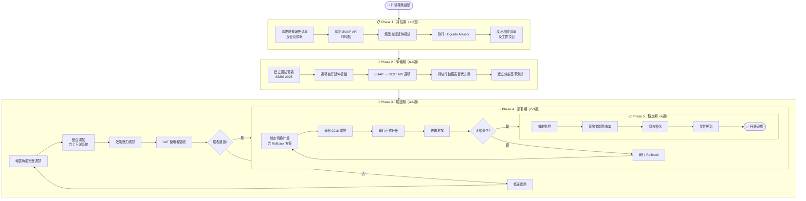

### 10.2 升級時程甘特圖

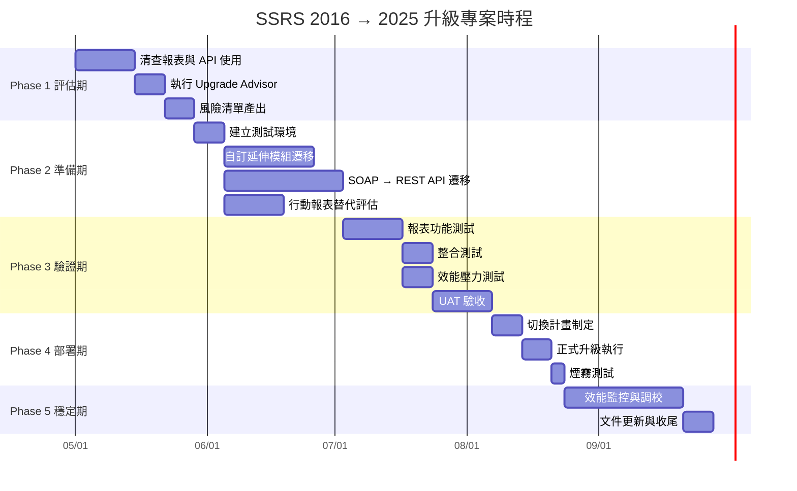

### 10.3 升級前後環境並行架構

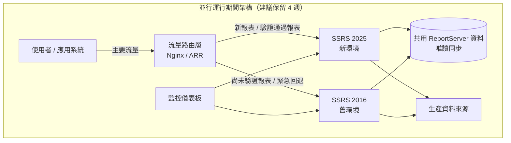

---

## 11. 結論與建議

### 11.1 升級結論

從架構師角度全面評估後，**強烈建議執行升級**，理由如下：

1. **安全合規性**：SSRS 2016 的 TLS 1.0/1.1 及 SHA-1 已不符合現代資安標準，存在合規風險
2. **技術債累積**：Silverlight、ActiveX、SOAP API 等技術已屬遺留技術，維護成本持續上升
3. **功能擴展性**：REST API v3、容器化支援、Power BI 深度整合為現代報表平台的必要能力
4. **微軟支援期限**：SSRS 2016 已進入延伸支援末期，官方 Bug Fix 與安全修補受限

### 11.2 關鍵成功因素

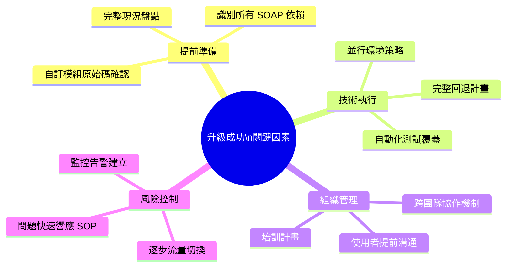

### 11.3 立即行動項目

| 優先序 | 行動項目 | 負責角色 | 期限 |
|-------|---------|---------|------|
| P0 | 清查所有使用 SOAP API 的應用系統 | 系統架構師 | 升級啟動後 2 週內 |
| P0 | 確認自訂延伸模組原始碼完整性 | 開發負責人 | 升級啟動後 2 週內 |
| P1 | 建立 SSRS 2025 測試環境 | 基礎架構團隊 | Phase 2 開始前 |
| P1 | 執行官方 Upgrade Advisor | 系統架構師 | Phase 1 完成前 |
| P2 | 規劃行動報表遷移至 Power BI | 報表開發團隊 | Phase 2 期間 |
| P2 | 制定 REST API 遷移時程 | 開發負責人 | Phase 2 期間 |

---

> 📌 **備註**：本報告基於 SSRS 2016 及 SSRS 2025（SQL Server 2025 Reporting Services）公開技術文件及架構最佳實踐撰寫。
> 實際升級前建議執行 Microsoft 官方 **Upgrade Advisor** 工具並參閱最新版 [Microsoft Docs](https://learn.microsoft.com/sql/reporting-services)。

## 12. 現有環境相依項目補充分析

根據現況說明，目前系統至少存在以下兩類 SSRS 相依模式：

1. **內嵌使用 `https://rs/reportserver` 網頁**
2. **直接存取 `https://rs/reportserver/ReportService.asmx` SOAP Web Service**

這代表現行系統並不只是「使用報表」，而是已經與 **SSRS 傳統入口介面** 與 **舊版 SOAP API** 有實質整合。  
若目標升級至 2025，這兩個整合點都必須被視為核心升級風險。

---

### 12.1 現況架構判讀

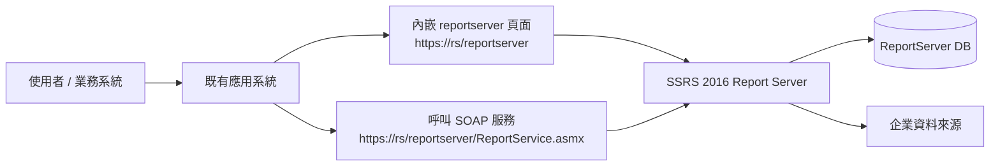

---

### 12.2 風險分析摘要

| 相依項目 | 現況 | 升級到 2025 的風險 | 建議 |
|---|---|---|---|
| 內嵌 `https://rs/reportserver` | 直接將 SSRS 頁面嵌入系統 | 高：UI、認證、Cookie、X-Frame-Options、路徑行為可能改變 | 改為正式嵌入架構或以新式 portal / URL access / token 模式重整 |
| `ReportService.asmx` | 使用 SOAP Web Service | 高：SOAP 屬舊式整合方式，未來可用性與維護性風險高 | 逐步改寫為 REST API |
| 舊版報表路徑依賴 | 可能使用固定 URL、固定參數格式 | 中高：升級後 URL 行為、驗證流程可能需調整 | 盤點所有 URL 組成規則與參數 |
| 驗證整合 | 可能依賴 Windows / NTLM / Intranet SSO | 中高：新環境若導入 OIDC / Entra ID，前端與 iframe 行為要重測 | 先確認目前登入機制 |
| 前端內嵌方式 | iframe / popup / redirect | 高：瀏覽器對第三方 Cookie、frame 安全限制更嚴格 | 優先盤點前端內嵌模式 |

---

### 12.3 針對 `https://rs/reportserver` 內嵌的分析

`/reportserver` 通常是 SSRS 的傳統端點，常見使用方式包括：

- 直接導向報表 URL
- 使用 iframe 內嵌報表畫面
- 以 URL Access 傳入參數控制報表輸出
- 倚賴瀏覽器與 Windows 驗證自動登入

這種模式在 2016 環境常見，但升級到 2025 時，主要會遇到以下問題：

#### 可能風險

1. **舊 URL 行為相容性不保證完全一致**
2. **入口頁面 UI 與資源載入方式可能改變**
3. **iframe 內嵌可能被瀏覽器安全政策限制**
4. **舊式整合可能依賴 session / cookie 行為**
5. **若導入較新驗證機制，SSO 行為可能與現況不同**

#### 建議處置

- 清查所有內嵌 `/reportserver` 的系統頁面
- 確認是：
  - iframe 內嵌
  - 直接轉址
  - popup 開窗
  - 反向代理後再嵌入
- 盤點所有 URL 參數，例如：
  - `rs:Command=Render`
  - `rc:Toolbar=false`
  - `rs:Format=PDF`
  - 自訂報表參數
- 驗證是否依賴瀏覽器自動帶入 AD 憑證
- 在測試環境逐頁驗證所有內嵌場景

#### 建議方向

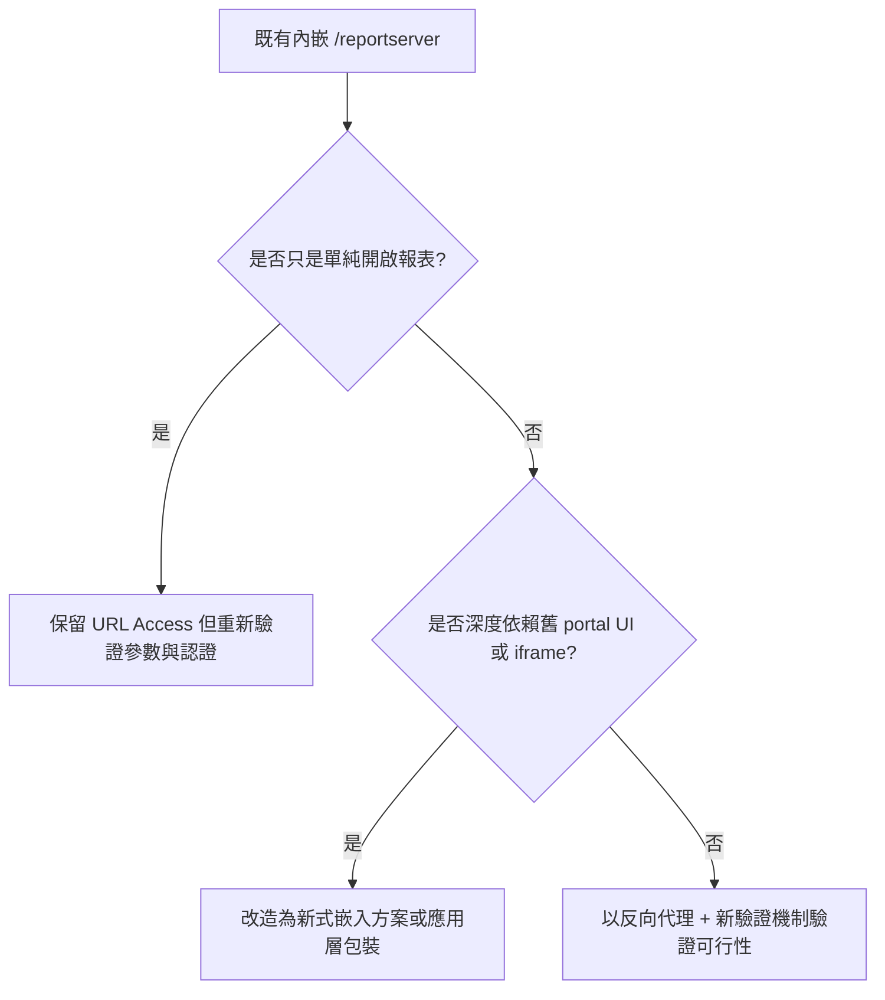

---

### 12.4 針對 `https://rs/reportserver/ReportService.asmx` 的分析

`ReportService.asmx` 是 SSRS 舊版 SOAP API 的典型端點。  
若現行系統有直接呼叫它，通常代表系統可能在做以下事情：

- 查詢報表清單
- 建立資料夾
- 上傳 / 發布報表
- 設定資料來源
- 取得參數定義
- 執行或管理訂閱
- 管理權限 / 安全性
- 讀取報表屬性

這是本次升級最重要的風險之一。

#### 為什麼高風險

1. **SOAP 屬舊式整合技術**
2. **新版本主推 REST API**
3. **舊有 client proxy、WSDL、驗證方式可能需要調整**
4. **若系統大量封裝 SOAP 呼叫，改造工作量可能不小**
5. **若有第三方排程或中介服務依賴 asmx，更容易在升級後出問題**

#### 建議處置

- 盤點所有呼叫 `ReportService.asmx` 的程式
- 區分呼叫用途：
  - 查詢型
  - 管理型
  - 發布型
  - 安全設定型
- 建立 SOAP 與 REST 對照表
- 先找出高頻與關鍵交易
- 對於可改寫項目，優先改寫到 REST
- 對於短期無法改寫者，規劃暫時相容策略，但不得作為長期方案

#### SOAP 轉型策略

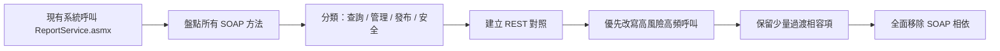

---

### 12.5 建議立即盤點清單

#### A. 內嵌 `/reportserver` 盤點

| 項目 | 說明 |
|---|---|
| 使用系統清單 | 哪些系統有嵌入 `/reportserver` |
| 使用頁面清單 | 哪些頁面有 iframe / redirect / popup |
| 報表 URL 清單 | 實際使用的完整 URL |
| URL 參數 | 所有 `rs:`、`rc:` 與報表參數 |
| 驗證方式 | Windows Auth / NTLM / Kerberos / Forms |
| 使用者族群 | 內部使用者 / 外部使用者 / VPN 使用者 |
| 瀏覽器版本 | Edge / Chrome / IE 模式 |
| 反向代理設定 | 是否經過 IIS / Nginx / ARR |

#### B. SOAP `ReportService.asmx` 盤點

| 項目 | 說明 |
|---|---|
| 呼叫系統名稱 | 哪些程式有呼叫 SOAP |
| 呼叫方法名稱 | 例如 ListChildren、GetItemDefinition、SetProperties |
| 呼叫頻率 | 高頻 / 中頻 / 低頻 |
| 重要性 | 核心交易 / 後台維運 / 管理功能 |
| 驗證模式 | NetworkCredential / 預設憑證 / 指定帳號 |
| 程式語言 | .NET Framework / Java / Script |
| 封裝位置 | 共用 library / 單一系統內 |
| 是否可替換 REST | 可 / 部分可 / 不易 |

---

### 12.6 建議新增到升級計畫的工作項目

| 優先序 | 工作項目 | 說明 |
|---|---|---|
| P0 | 盤點所有 `/reportserver` 內嵌頁面 | 確認前端整合模式 |
| P0 | 盤點所有 `ReportService.asmx` 呼叫 | 確認 SOAP 相依程度 |
| P0 | 建立 SOAP 方法與業務功能對照表 | 避免只看到技術呼叫，忽略業務影響 |
| P1 | 建立 REST API 替代設計 | 作為升級後標準介面 |
| P1 | 建立測試環境驗證 iframe / SSO | 優先確認最容易失敗的場景 |
| P1 | 建立 URL Access 相容性測試案例 | 驗證所有既有報表連結 |
| P2 | 制定過渡期雙軌策略 | 新舊方式並行一段時間 |
| P2 | 規劃最終移除 SOAP 時程 | 避免永久保留技術債 |

---

### 12.7 架構師建議

從架構角度判斷，您這次不是單純的「SSRS 版本升級」，而是一次：

- **報表平台升級**
- **整合介面升級**
- **驗證模式升級**
- **前端嵌入模式重整**

因此建議專案定位應提升為：

> **「SSRS 2016 Legacy Integration Modernization」**
> 而非單純 Infrastructure Upgrade。

若只做基礎升級而不處理 `/reportserver` 與 `ReportService.asmx` 相依，
正式上線後極可能發生：

- 報表頁面無法內嵌
- 使用者重複登入
- SOAP 呼叫失敗
- 訂閱 / 管理功能異常
- 某些報表雖存在，但應用系統無法正常串接

---

### 12.8 結論

現況已確認存在兩項高風險舊式整合：

1. **內嵌 `https://rs/reportserver`**
2. **呼叫 `https://rs/reportserver/ReportService.asmx`**

這表示升級到 2025 時，**不能只做系統層級升版**，必須同步進行：

- 前端嵌入模式檢視
- 認證與 SSO 驗證
- URL Access 相容性測試
- SOAP 服務盤點與 REST 改造

否則即使報表主機成功升級，業務系統仍可能無法正常使用。

---
*報告撰寫：資深系統架構師 | 日期：2026-04-30*