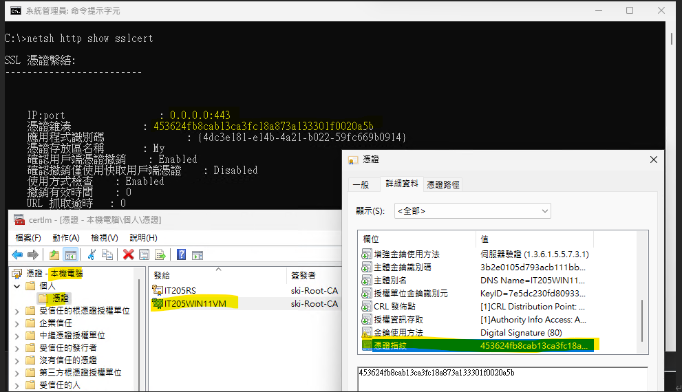
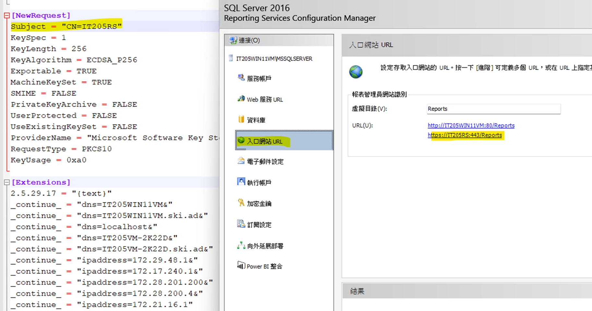
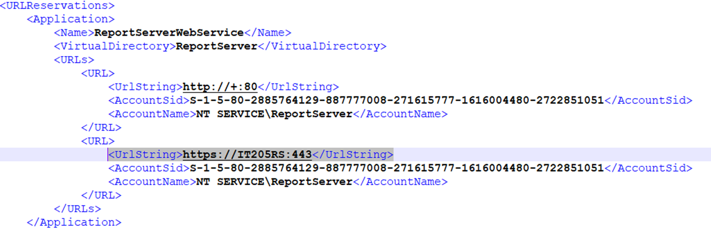
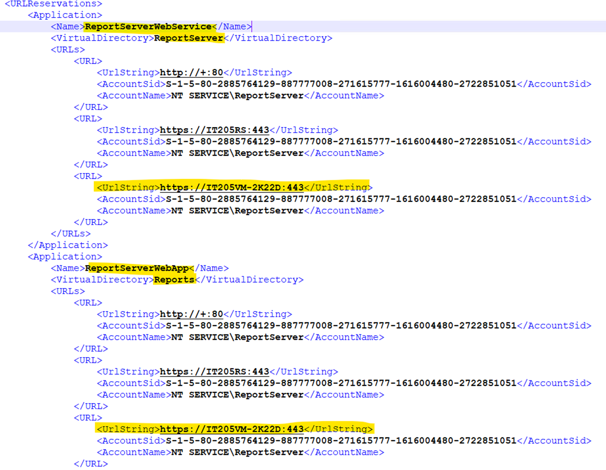
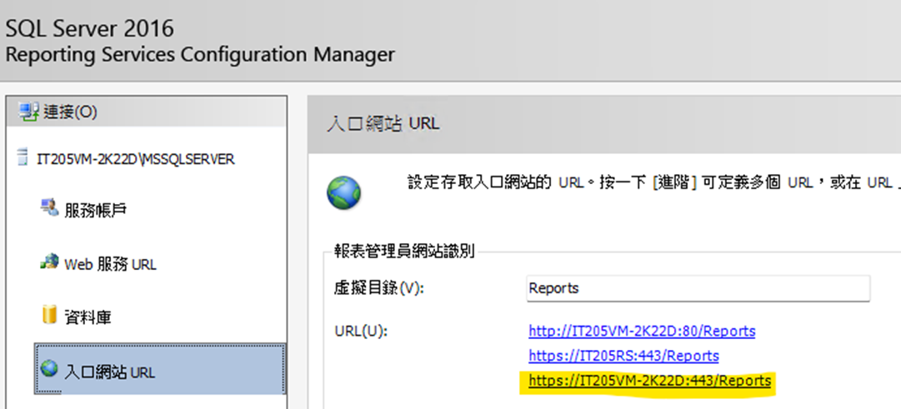
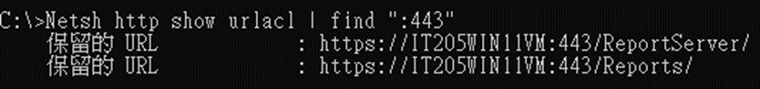
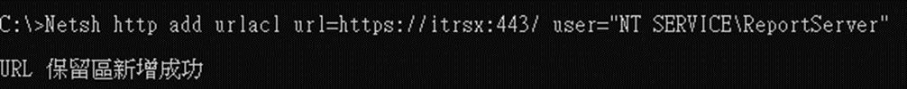

RS設定憑證筆記
RS2016開始跟IIS脫鉤，Host的方式是靠HTTP.sys Web Server
同一個IP:PROT綁定多張憑證會錯誤
可以用指令檢查IP:PORT綁定的憑證
Netsh http show sslcert
如果綁錯憑證可以用指令刪除
綁定的憑證在certml.msc可以找到

憑證有多個SAN，但Reporting Service設定的可存取的URL只有主要的名稱(CN.Subject)
其餘的主體別名要自行到rsreportserver.config設定
\Program Files\Microsoft SQL Server\MSRS13.MSSQLSERVER\Reporting Services\ReportServer
以下是預設值

新增VM名稱的設定

RS設定完畢應該會自動設定URL的ACL，如果有異常可以用指令檢查
Netsh http show urlacl

如果沒有設定URL可以存取，會無法存取，可以直接用add urlacl去新增
例如 ：Netsh http add urlacl url=https://itrsx:443/ user="NT SERVICE\ReportServer"

<RS安裝ODP.NET>
https://www.oracle.com/database/technologies/net-downloads.html
只要下載 ODAC Xcopy版 (例：ODAC122010Xcopy_x64.zip)
Oracle .NET, Visual Studio, and VS Code ODAC Downloads for Oracle Database
執行 install.bat asp.net4  c:\oracle myhome true ture
在把設定檔放到 C:\oralce\network\admin

2026/07/03
在 SSRS 和 Power BI 報表伺服器中設定 Oracle 連線類型
https://learn.microsoft.com/zh-tw/sql/reporting-services/report-data/oracle-connection-type-ssrs?view=sql-server-ver17
