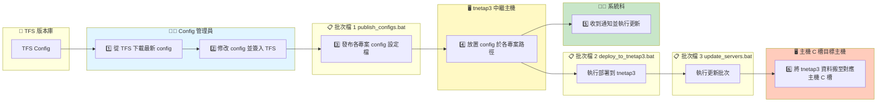
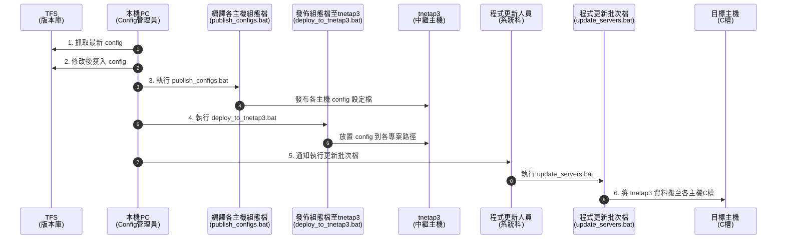

1. 本機 PC 將 TFS 上 config 最新設定抓下來
2. config 進行更新修改，簽入 TFS
3. 透過【publish_configs.bat】發布各專案 config 設定檔
4. 透過【deploy_to_tnetap3.bat】將各專案 config 設定檔放置 tnetap3 各專案路徑中
5. 程式科通知系統科執行【更新批次檔】
6. 【更新批次檔】將 tnetap3 資料搬至對應主機 C 槽

