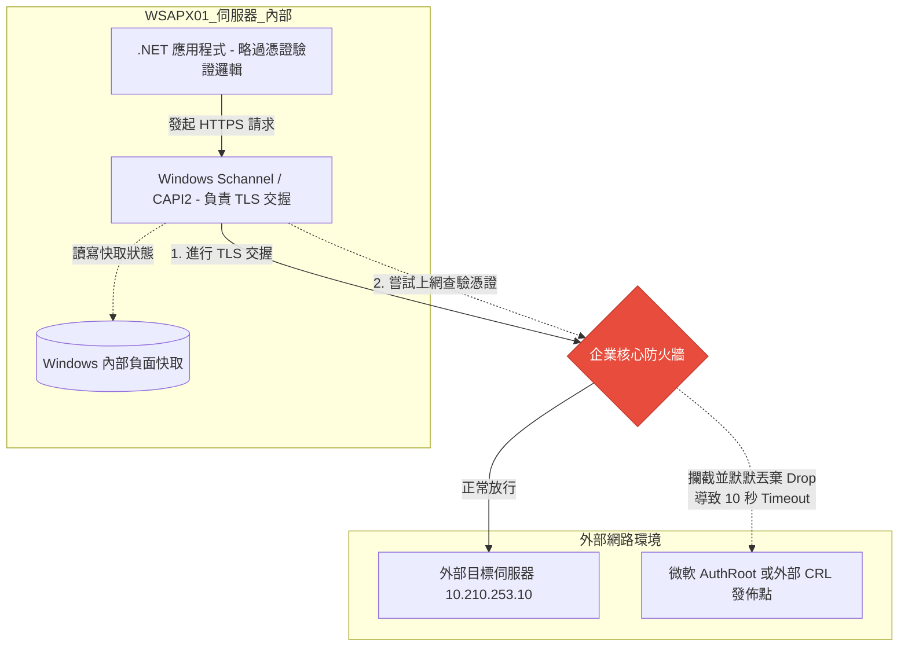
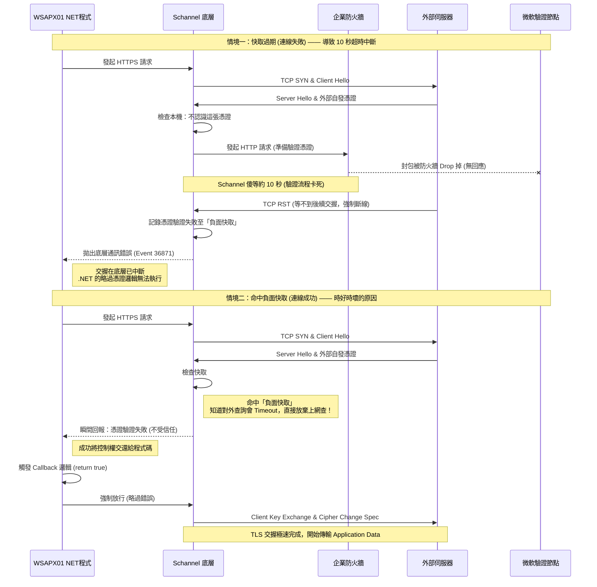

# WSX壽險累保連線失敗處理：
## TLS 1.2 交握超時與「時好時壞」連線問題排查紀錄

---

## 1. 問題描述

在內部伺服器（WSAPX01）透過背景服務（以 `NT AUTHORITY\SYSTEM` 身分執行）呼叫壽險累保（10.210.253.10）時，發生 TLS 連線「時好時壞」的狀況（例如：連續發動 3 次，第 1 次成功，第 2、3 次失敗）。

外部伺服器使用的是**自發憑證 (Self-Signed Certificate)**。內部 .NET 程式碼中已加入略過憑證驗證的邏輯（`ServerCertificateValidationCallback = true`），且登錄檔已啟用 TLS 1.2，但連線依然極度不穩定。

## 2. 症狀與排查發現

### 2.1 系統事件檢視器 (Event Viewer)
在 WSAPX01 的「系統」日誌中，頻繁出現來源為 **Schannel** 的錯誤：
* **Event ID:** 36871
* **描述:** 在建立 TLS 用戶端認證時發生嚴重錯誤。
* **User:** `SYSTEM` (S-1-5-18)

### 2.2 Wireshark 封包分析
封包側錄檔案 WSAPX20260401.cap
透過擷取 WSAPX01 與 10.210.253.10 之間的封包，發現連線失敗時存在標準的**「超時斷線 (Timeout)」**特徵：
1.  用戶端送出 `Client Hello`。
2.  伺服器迅速回應 `Server Hello`（夾帶外部自發憑證）。
3.  **【異常點】** 用戶端隨後陷入長達 **10 秒鐘** 的完全靜默，未送出預期的 `Client Key Exchange`。
4.  10 秒後，外部伺服器因等待交握超時，主動發送 `TCP RST (Reset)` 強制切斷連線。

## 3. 根本原因分析 (Root Cause)

這個「薛丁格的連線 Bug」是由三個底層機制交織而成的結果：**Schannel 驗證機制**、**企業防火牆阻擋規則**，以及 **Windows 憑證負面快取**。

### 3.1 為什麼「程式寫了略過憑證」卻無效？
Windows 底層網路通訊組件 (Schannel) 的處理優先級高於 .NET 應用程式。當 Schannel 收到外部自發憑證時，因為不認識該憑證的發行者，作業系統預設會觸發**自動根憑證更新 (AuthRoot)**，試圖連上網際網路（微軟的更新伺服器）去查驗該憑證。如果連線在作業系統底層就崩潰，憑證根本不會交給 .NET 程式層，略過邏輯連執行的機會都沒有。

### 3.2 致命的 10 秒空窗期 (Firewall Drop)
在企業內網環境中，伺服器通常無法直接連外網。當 Schannel 發起對外驗證憑證的 HTTP 請求時，如果企業防火牆的規則是**默默丟棄 (Drop)** 封包而非主動拒絕 (Reject)，Schannel 就會卡在那裡死等回應。這個等待時間剛好約為 10 秒，最終導致外部伺服器等得不耐煩而強制斷線 (`TCP RST`)。

### 3.3 為什麼會「時好時壞」？(Windows 負面快取機制)
Windows 的加密 API (CAPI2) 具有**負面快取 (Negative Cache)** 機制，這解釋了為何有時連線會成功：
* **連線失敗（無快取 / 快取過期）：** Schannel 上網查驗 $\rightarrow$ 被防火牆 Drop $\rightarrow$ 傻等 10 秒 $\rightarrow$ 遭外部斷線 $\rightarrow$ 紀錄失敗狀態至快取。
* **連線成功（命中負面快取）：** Schannel 再次收到同張自發憑證 $\rightarrow$ 發現快取寫著「查不到」 $\rightarrow$ **放棄上網查驗**，瞬間將「憑證錯誤」狀態拋給上層 .NET $\rightarrow$ 觸發 .NET 程式中的略過憑證邏輯 $\rightarrow$ 強制放行，交握極速完成！

## 4. 解決方案

最根本且標準的解法是阻止 Windows 作業系統發起對外的憑證查驗請求。

**操作步驟：**
1.  取得外部單位的自發憑證檔案。
2.  在 WSAPX01 伺服器上，開啟本機電腦憑證管理員 (`certlm.msc`)。
3.  將該自發憑證匯入至 **「受信任的根憑證授權單位」 $\rightarrow$ 「憑證」**。

**結果：**
匯入後，Schannel 收到憑證會立刻在本機比對成功並信任，**直接放棄上網查詢**，從源頭避開了防火牆的 10 秒 Timeout。交握瞬間完成，問題徹底解決。

---

## 5. 架構與循序圖參考

### 5.1 系統架構圖

### 5.2 交握行為循序圖 (失敗與成功的情境對比)
