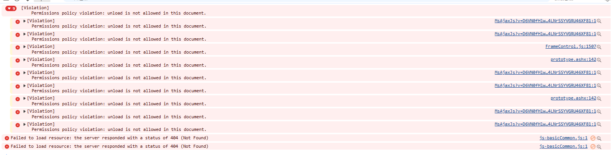

# Edge `unload` 權限錯誤整理與處理方式

## 問題描述

在前端（Edge 瀏覽器）出現錯誤：

- `Permissions policy violation: unload is not allowed in this document`



此訊息表示：目前文件（document）生效中的 **Permissions-Policy** 不允許 `unload`，但頁面程式碼或第三方腳本仍嘗試使用 `unload` / `onunload`。

---

## 常見成因

1. 回應標頭設定了禁止 `unload`
   - 例如：`Permissions-Policy: unload=()`
2. 未明確允許 `unload`，且瀏覽器/政策預設限制
3. 企業環境（Edge）套用了政策（Policy）影響預設行為
   - `ForcePermissionPolicyUnloadDefaultEnabled`
4. 非原站設定覆蓋
   - 反向代理、CDN、WAF、IIS Rewrite 可能覆寫 Header

---

## 版本與行為重點（Edge / Chromium）

> 重點：不是單一 Edge 版本「一次全面禁用 unload」，而是 Chromium 生態的**漸進式淘汰**。

| Edge 版本區間 | Chromium 核心 | 影響判斷 |
|---|---:|---|
| Edge 106 以前 | 106- | 尚未進入 `Permissions-Policy: unload` 主要實作期 |
| Edge 107 | 107 | 可對應到 `permissions-policy unload` 支援起點 |
| Edge 108+ | 108+ | `unload` 在淘汰路徑上，行為受版本/實驗/政策影響 |
| 現代版本（120+） | 120+ | 建議不要依賴 `unload` |

---

## 處理方式總覽

## A. 調整機碼
路徑 (強制)：SOFTWARE\Policies\Microsoft\Edge
路徑 (建議)：不適用
值名稱：ForcePermissionPolicyUnloadDefaultEnabled
價值類型：REG_DWORD

**缺點**
逐台電腦調整，且對全部網站開放

---

## B. Edge 群組原則 (ADMX) 資訊
GP 唯一名稱：ForcePermissionPolicyUnloadDefaultEnabled
GP 名稱：控制是否能停用卸載事件處理程序。
GP 路徑 (強制) ：管理範本/Microsoft Edge
GP 路徑 (建議)：不適用
GP ADMX 檔案名稱：MSEdge.admx

**缺點**
僅限企業內部PC，外部使用者(B2B)無法設定，且對全部網站開放

---

## C. 伺服器端允許 `unload` (最後選擇方案)

若系統短期內無法改程式，可在回應標頭明確設定：

- 建議先用同源：
  - `Permissions-Policy: unload=(self)`
- 全放開（較不建議）：
  - `Permissions-Policy: unload=*`

---

## D. **可評估做法：移除對 `unload` 的依賴**

將 `window.onunload` / `unload` 監聽改為：

- `pagehide`
- `visibilitychange`
- `navigator.sendBeacon()`

### 範例（送出離頁紀錄）
```js
window.addEventListener("pagehide", () => {
  navigator.sendBeacon("/log/leave", JSON.stringify({ ts: Date.now() }));
});

document.addEventListener("visibilitychange", () => {
  if (document.visibilityState === "hidden") {
    navigator.sendBeacon("/log/hidden", JSON.stringify({ ts: Date.now() }));
  }
});
```

**優點**
- 相容現代瀏覽器策略
- 降低被政策或版本變動影響

**缺點**
需要修改程式和測試穩定度

### C. 伺服器端允許 `unload` 設定方式
### IIS / ASP.NET Framework 4.6.1（Web.config）
```xml
<configuration>
  <system.webServer>
    <httpProtocol>
      <customHeaders>
        <add name="Permissions-Policy" value="unload=(self)" />
      </customHeaders>
    </httpProtocol>
  </system.webServer>
</configuration>
```

> 注意：若上游（CDN/Proxy）有覆蓋 Header，IIS 設定可能不會是最終值。


## 參考資料

- Chrome: Deprecating the unload event  
  https://developer.chrome.com/docs/web-platform/deprecating-unload
- Chromium: Permissions Policy `unload` 實驗文件  
  https://chromium.googlesource.com/chromium/src.git/+/HEAD/docs/experiments/permissions-policy-unload.md
- Microsoft Edge Policy: `ForcePermissionPolicyUnloadDefaultEnabled`  
  https://learn.microsoft.com/zh-tw/deployedge/microsoft-edge-policies/forcepermissionpolicyunloaddefaultenabled