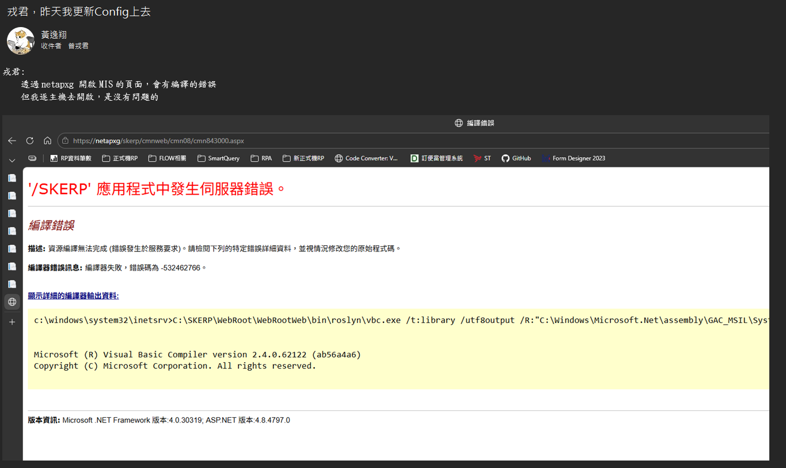

'/SKERP' 應用程式中發生伺服器錯誤。
編譯錯誤
描述: 資源編譯無法完成 (錯誤發生於服務要求)。請檢閱下列的特定錯誤詳細資料，並視情況修改您的原始程式碼。

編譯器錯誤訊息: 編譯器失敗，錯誤碼為 -532462766。

顯示詳細的編譯器輸出資料:

c:\windows\system32\inetsrv>C:\SKERP\WebRoot\WebRootWeb\bin\roslyn\vbc.exe /t:library /utf8output /R:"C:\Windows\Microsoft.Net\assembly\GAC_MSIL\System.Runtime\v4.0_4.0.0.0__b03f5f7f11d50a3a\System.Runtime.dll" /R:"C:\Windows\Microsoft.Net\assembly\GAC_MSIL\System.Configuration\v4.0_4.0.0.0__b03f5f7f11d50a3a\System.Configuration.dll" /R:"C:\Windows\Microsoft.NET\Framework64\v4.0.30319\Temporary ASP.NET Files\skerp\b0bf980a\7aa0cff6\assembly\dl3\9402242a\aa0e37aa_9be8da01\IntelliSys.NetExpress.DAO.dll" /R:"C:\Windows\Microsoft.NET\Framework64\v4.0.30319\Temporary ASP.NET Files\skerp\b0bf980a\7aa0cff6\assembly\dl3\5db22149\5639da85_a5feda01\BBSService.dll" /R:"C:\Windows\Microsoft.NET\Framework64\v4.0.30319\Temporary ASP.NET Files\skerp\b0bf980a\7aa0cff6\assembly\dl3\399511ea\dc11483b_e751dc01\SCSWeb.dll" /R:"C:\Windows\Microsoft.NET\Framework64\v4.0.30319\Temporary ASP.NET Files\skerp\b0bf980a\7aa0cff6\assembly\dl3\fbcc7c2a\83ace2fb_3b4cdb01\IntelliSys.NetExpress.Web.dll" /R:"C:\Windows\Microsoft.NET\Framework64\v4.0.30319\Temporary ASP.NET Files\skerp\b0bf980a\7aa0cff6\assembly\dl3\53af768f\0092c17a_ce1fc901\CodeRule.dll" /R:"C:\Windows\Microsoft.NET\Framework64\v4.0.30319\Temporary ASP.NET Files\skerp\b0bf980a\7aa0cff6\assembly\dl3\6175cc19\d11d8c23_036fdc01\WorkFlowWeb.dll" /R:"C:\Windows\Microsoft.Net\assembly\GAC_MSIL\System.Web.Extensions.Design\v4.0_4.0.0.0__31bf3856ad364e35\System.Web.Extensions.Design.dll" /R:"C:\Windows\Microsoft.NET\Framework64\v4.0.30319\Temporary ASP.NET Files\skerp\b0bf980a\7aa0cff6\assembly\dl3\0a0bd39b\dfbbd9f5_ebe1dc01\SAMService.dll" /R:"C:\Windows\Microsoft.NET\Framework64\v4.0.30319\Temporary ASP.NET Files\skerp\b0bf980a\7aa0cff6\assembly\dl3\714e7731\5577bb70_25f3dc01\ACTWeb.dll" /R:"C:\Windows\Microsoft.Net\assembly\GAC_MSIL\System.Core\v4.0_4.0.0.0__b77a5c561934e089\System.Core.dll" /R:"C:\Windows\Microsoft.Net\assembly\GAC_MSIL\Microsoft.CSharp\v4.0_4.0.0.0__b03f5f7f11d50a3a\Microsoft.CSharp.dll" /R:"C:\Windows\Microsoft.NET\Framework64\v4.0.30319\Temporary ASP.NET Files\skerp\b0bf980a\7aa0cff6\assembly\dl3\6433b33e\5e3ff1fc_9067d401\DataTier.dll" /R:"C:\Windows\Microsoft.NET\Framework64\v4.0.30319\Temporary ASP.NET Files\skerp\b0bf980a\7aa0cff6\assembly\dl3\2d2a48c5\c25e8c6a_25f3dc01\ACTService.dll" /R:"C:\Windows\Microsoft.NET\Framework64\v4.0.30319\Temporary ASP.NET Files\skerp\b0bf980a\7aa0cff6\assembly\dl3\5c585bc6\c6a1f3fc_9067d401\ProgStudios.WebControls.dll" /R:"C:\Windows\Microsoft.NET\Framework64\v4.0.30319\Temporary ASP.NET Files\skerp\b0bf980a\7aa0cff6\assembly\dl3\0739a2cc\e2d258c8_9afcdc01\CUSService.dll" /R:"C:\Windows\Microsoft.NET\Framework64\v4.0.30319\Temporary ASP.NET Files\skerp\b0bf980a\7aa0cff6\assembly\dl3\eb2bd00d\e0415623_23fedc01\PUBService.dll" /R:"C:\Windows\Microsoft.Net\assembly\GAC_MSIL\System.Web.Services\v4.0_4.0.0.0__b03f5f7f11d50a3a\System.Web.Services.dll" /R:"C:\Windows\Microsoft.NET\Framework64\v4.0.30319\Temporary ASP.NET Files\skerp\b0bf980a\7aa0cff6\assembly\dl3\e80ac60e\e1e80f4c_63b1d401\Engine.dll" /R:"C:\Windows\Microsoft.NET\Framework64\v4.0.30319\Temporary ASP.NET Files\skerp\b0bf980a\7aa0cff6\assembly\dl3\a83bd9af\8916509a_1df8d501\ISNEJobLib.dll" /R:"C:\Windows\Microsoft.Net\assembly\GAC_MSIL\System.Xml\v4.0_4.0.0.0__b77a5c561934e089\System.Xml.dll" /R:"C:\Windows\Microsoft.NET\Framework64\v4.0.30319\Temporary ASP.NET Files\skerp\b0bf980a\7aa0cff6\assembly\dl3\897f2fa7\625c1e92_9aa4dc01\FIXEntity.dll" /R:"C:\Windows\Microsoft.NET\Framework64\v4.0.30319\Temporary ASP.NET Files\skerp\b0bf980a\7aa0cff6\assembly\dl3\976e5767\80f19c13_e994d301\ISNEUtilWeb.dll" /R:"C:\Windows\Microsoft.NET\Framework64\v4.0.30319\Temporary ASP.NET Files\skerp\b0bf980a\7aa0cff6\assembly\dl3\6e4995ce\e31c6c38_e751dc01\SCSEntity.dll" /R:"C:\Windows\Microsoft.Net\assembly\GAC_MSIL\System.ServiceModel.Activities\v4.0_4.0.0.0__31bf3856ad364e35\System.ServiceModel.Activities.dll" /R:"C:\Windows\Microsoft.NET\Framework64\v4.0.30319\Temporary ASP.NET Files\skerp\b0bf980a\7aa0cff6\assembly\dl3\e59ded64\00d40308_4646d301\Microsoft.CodeDom.Providers.DotNetCompilerPlatform.dll" /R:"C:\Windows\Microsoft.NET\Framework64\v4.0.30319\Temporary ASP.NET Files\skerp\b0bf980a\7aa0cff6\assembly\dl3\23199352\8ef09c8b_a5a4dc01\MARCLMEntity.dll" /R:"C:\Windows\Microsoft.NET\Framework64\v4.0.30319\Temporary ASP.NET Files\skerp\b0bf980a\7aa0cff6\assembly\dl3\a8c5bd33\6a0846b3_9aa4dc01\FixService.dll" /R:"C:\Windows\Microsoft.NET\Framework64\v4.0.30319\Temporary ASP.NET Files\skerp\b0bf980a\7aa0cff6\assembly\dl3\286a9993\4d5cbf87_dbf7dc01\INVEntity.dll" /R:"C:\Windows\Microsoft.NET\Framework64\v4.0.30319\Temporary ASP.NET Files\skerp\b0bf980a\7aa0cff6\assembly\dl3\a6ee6ae1\23e9877c_028fda01\ISNEWebService.dll" /R:"C:\Windows\Microsoft.NET\Framework64\v4.0.30319\Temporary ASP.NET Files\skerp\b0bf980a\7aa0cff6\assembly\dl3\77d0a6ab\f7e14f6f_69fddc01\GLSService.dll" /R:"C:\Windows\Microsoft.NET\Framework64\v4.0.30319\Temporary ASP.NET Files\skerp\b0bf980a\7aa0cff6\assembly\dl3\8987bf15\003f07ed_02b0cc01\itextsharp.dll" /R:"C:\Windows\Microsoft.NET\Framework64\v4.0.30319\Temporary ASP.NET Files\skerp\b0bf980a\7aa0cff6\assembly\dl3\40756823\0096bc87_f4acd701\ICSharpCode.SharpZipLib.dll" /R:"C:\Windows\Microsoft.NET\Framework64\v4.0.30319\Temporary ASP.NET Files\skerp\b0bf980a\7aa0cff6\assembly\dl3\e01b88fe\1872aad2_59e7dc01\RINService.dll" /R:"C:\Windows\Microsoft.NET\Framework64\v4.0.30319\Temporary ASP.NET Files\skerp\b0bf980a\7aa0cff6\assembly\dl3\3b7cf2a0\a273fcd5_5c9adc01\GASService.dll" /R:"C:\Windows\Microsoft.NET\Framework64\v4.0.30319\Temporary ASP.NET Files\skerp\b0bf980a\7aa0cff6\App_global.asax.oonadirl.dll" /R:"C:\Windows\Microsoft.NET\Framework64\v4.0.30319\Temporary ASP.NET Files\skerp\b0bf980a\7aa0cff6\assembly\dl3\df80c0a6\a33d2139_23fedc01\PUBControl.dll" /R:"C:\Windows\Microsoft.NET\Framework64\v4.0.30319\Temporary ASP.NET Files\skerp\b0bf980a\7aa0cff6\assembly\dl3\ddac7828\7dcc21df_36dddc01\ACHService.dll" /R:"C:\Windows\Microsoft.NET\Framework64\v4.0.30319\Temporary ASP.NET Files\skerp\b0bf980a\7aa0cff6\assembly\dl3\57a1d6e3\e2221778_3a59dc01\B2BService.dll" /R:"C:\Windows\Microsoft.Net\assembly\GAC_MSIL\System.ServiceModel\v4.0_4.0.0.0__b77a5c561934e089\System.ServiceModel.dll" /R:"C:\Windows\Microsoft.NET\Framework64\v4.0.30319\Temporary ASP.NET Files\skerp\b0bf980a\7aa0cff6\assembly\dl3\3bfa3066\001a46c8_1fcad201\AjaxControlToolkit.dll" /R:"C:\Windows\Microsoft.NET\Framework64\v4.0.30319\Temporary ASP.NET Files\skerp\b0bf980a\7aa0cff6\assembly\dl3\9a89d9dd\00432519_420ad601\NPOI.OpenXml4Net.dll" /R:"C:\Windows\Microsoft.Net\assembly\GAC_MSIL\System.Design\v4.0_4.0.0.0__b03f5f7f11d50a3a\System.Design.dll" /R:"C:\Windows\Microsoft.NET\Framework64\v4.0.30319\Temporary ASP.NET Files\skerp\b0bf980a\7aa0cff6\assembly\dl3\7f474108\00182389_49bcd401\PdfSharp.dll" /R:"C:\Windows\Microsoft.NET\Framework64\v4.0.30319\Temporary ASP.NET Files\skerp\b0bf980a\7aa0cff6\assembly\dl3\15358b23\766fbeab_72f9dc01\CMNService.dll" /R:"C:\Windows\Microsoft.NET\Framework64\v4.0.30319\Temporary ASP.NET Files\skerp\b0bf980a\7aa0cff6\assembly\dl3\7892e576\a37c6951_33f3dc01\MarEntity.dll" /R:"C:\Windows\Microsoft.NET\Framework64\v4.0.30319\Temporary ASP.NET Files\skerp\b0bf980a\7aa0cff6\App_Web_site.master.cdcab7d2.v-qu-mrc.dll" /R:"C:\Windows\Microsoft.NET\Framework64\v4.0.30319\Temporary ASP.NET Files\skerp\b0bf980a\7aa0cff6\assembly\dl3\e56e82d6\f9eff2bd_36dddc01\ACHEntity.dll" /R:"C:\Windows\Microsoft.NET\Framework64\v4.0.30319\Temporary ASP.NET Files\skerp\b0bf980a\7aa0cff6\assembly\dl3\5cd9081c\6bbb1077_33f3dc01\MarLib.dll" /R:"C:\Windows\Microsoft.NET\Framework64\v4.0.30319\Temporary ASP.NET Files\skerp\b0bf980a\7aa0cff6\assembly\dl3\4dad81c6\8df45ddf_72f9dc01\CMNWeb.XmlSerializers.dll" /R:"C:\Windows\Microsoft.NET\Framework64\v4.0.30319\Temporary ASP.NET Files\skerp\b0bf980a\7aa0cff6\assembly\dl3\f9f86c3c\6bb2f997_f8b6da01\WebRoot.dll" /R:"C:\Windows\Microsoft.NET\Framework64\v4.0.30319\Temporary ASP.NET Files\skerp\b0bf980a\7aa0cff6\assembly\dl3\9d67e56d\ab0c213a_23fedc01\PUBControl.XmlSerializers.dll" /R:"C:\Windows\Microsoft.NET\Framework64\v4.0.30319\Temporary ASP.NET Files\skerp\b0bf980a\7aa0cff6\assembly\dl3\1fa9e22b\0cdc12ad_f0fedc01\CarEntity.XmlSerializers.dll" /R:"C:\Windows\Microsoft.NET\Framework64\v4.0.30319\Temporary ASP.NET Files\skerp\b0bf980a\7aa0cff6\assembly\dl3\7136b65b\8a943f17_23fedc01\PUBEntity.dll" /R:"C:\Windows\Microsoft.NET\Framework64\v4.0.30319\Temporary ASP.NET Files\skerp\b0bf980a\7aa0cff6\assembly\dl3\8cf44a0b\0056d54c_e090d301\AspNet.ScriptManager.jQuery.dll" /R:"C:\Windows\Microsoft.Net\assembly\GAC_MSIL\System.ServiceModel.Web\v4.0_4.0.0.0__31bf3856ad364e35\System.ServiceModel.Web.dll" /R:"C:\Windows\Microsoft.NET\Framework64\v4.0.30319\Temporary ASP.NET Files\skerp\b0bf980a\7aa0cff6\assembly\dl3\69d110a1\556c082b_3afedc01\FIRWeb.dll" /R:"C:\Windows\Microsoft.NET\Framework64\v4.0.30319\Temporary ASP.NET Files\skerp\b0bf980a\7aa0cff6\assembly\dl3\7f612b41\d592d013_f7fedc01\CASWeb.dll" /R:"C:\Windows\Microsoft.NET\Framework64\v4.0.30319\Temporary ASP.NET Files\skerp\b0bf980a\7aa0cff6\assembly\dl3\2ea08031\00182389_49bcd401\PdfSharp.Charting.dll" /R:"C:\Windows\Microsoft.NET\Framework64\v4.0.30319\Temporary ASP.NET Files\skerp\b0bf980a\7aa0cff6\assembly\dl3\5bfa400e\e3ef113c_a5f1dc01\PSNWeb.dll" /R:"C:\Windows\Microsoft.Net\assembly\GAC_MSIL\System.Drawing\v4.0_4.0.0.0__b03f5f7f11d50a3a\System.Drawing.dll" /R:"C:\Windows\Microsoft.NET\Framework64\v4.0.30319\Temporary ASP.NET Files\skerp\b0bf980a\7aa0cff6\assembly\dl3\5ffc8eb8\00b785ba_a610c801\Utility.dll" /R:"C:\Windows\Microsoft.NET\Framework64\v4.0.30319\Temporary ASP.NET Files\skerp\b0bf980a\7aa0cff6\assembly\dl3\267e79a3\aefa9ae8_39fedc01\FIREntity.dll" /R:"C:\Windows\Microsoft.NET\Framework64\v4.0.30319\Temporary ASP.NET Files\skerp\b0bf980a\7aa0cff6\assembly\dl3\a12b779e\bbb48467_ede1dc01\RIIEntity.dll" /R:"C:\Windows\Microsoft.NET\Framework64\v4.0.30319\Temporary ASP.NET Files\skerp\b0bf980a\7aa0cff6\assembly\dl3\27b26c27\3d1ddea6_ec0cd401\SAMPLEWeb.dll" /R:"C:\Windows\Microsoft.NET\Framework64\v4.0.30319\Temporary ASP.NET Files\skerp\b0bf980a\7aa0cff6\assembly\dl3\ab0d361f\a35bc1ee_75acdc01\BFSWeb.dll" /R:"C:\Windows\Microsoft.NET\Framework64\v4.0.30319\Temporary ASP.NET Files\skerp\b0bf980a\7aa0cff6\assembly\dl3\683d65bf\110ec216_3afedc01\FIRService.dll" /R:"C:\Windows\Microsoft.NET\Framework64\v4.0.30319\Temporary ASP.NET Files\skerp\b0bf980a\7aa0cff6\assembly\dl3\f8ba3192\0398d05b_a5feda01\BBSEntity.dll" /R:"C:\Windows\Microsoft.NET\Framework64\v4.0.30319\Temporary ASP.NET Files\skerp\b0bf980a\7aa0cff6\assembly\dl3\7346f47d\8fbb8044_7827d601\IntelliSys.NetExpress.Entity.dll" /R:"C:\Windows\Microsoft.NET\Framework64\v4.0.30319\Temporary ASP.NET Files\skerp\b0bf980a\7aa0cff6\assembly\dl3\fdeaf82f\00432519_420ad601\NPOI.OOXML.dll" /R:"C:\Windows\Microsoft.Net\assembly\GAC_64\System.Data\v4.0_4.0.0.0__b77a5c561934e089\System.Data.dll" /R:"C:\Windows\Microsoft.NET\Framework64\v4.0.30319\Temporary ASP.NET Files\skerp\b0bf980a\7aa0cff6\assembly\dl3\f56c0342\3c820990_72f9dc01\CMNEntity.dll" /R:"C:\Windows\Microsoft.NET\Framework64\v4.0.30319\Temporary ASP.NET Files\skerp\b0bf980a\7aa0cff6\assembly\dl3\a2e4414d\9f28d028_23fedc01\PUBService.XmlSerializers.dll" /R:"C:\Windows\Microsoft.Net\assembly\GAC_64\System.Web\v4.0_4.0.0.0__b03f5f7f11d50a3a\System.Web.dll" /R:"C:\Windows\Microsoft.NET\Framework64\v4.0.30319\Temporary ASP.NET Files\skerp\b0bf980a\7aa0cff6\assembly\dl3\de360aea\008353de_db05d601\BouncyCastle.Crypto.dll" /R:"C:\Windows\Microsoft.NET\Framework64\v4.0.30319\Temporary ASP.NET Files\skerp\b0bf980a\7aa0cff6\App_Web_1njnygfj.dll" /R:"C:\Windows\Microsoft.NET\Framework64\v4.0.30319\Temporary ASP.NET Files\skerp\b0bf980a\7aa0cff6\assembly\dl3\16dc2d15\62b6c19e_468ad501\AOIService.XmlSerializers.dll" /R:"C:\Windows\Microsoft.NET\Framework64\v4.0.30319\Temporary ASP.NET Files\skerp\b0bf980a\7aa0cff6\assembly\dl3\a1e6096d\834e8cf8_f0fedc01\CarService.XmlSerializers.dll" /R:"C:\Windows\Microsoft.NET\Framework64\v4.0.30319\Temporary ASP.NET Files\skerp\b0bf980a\7aa0cff6\assembly\dl3\0eb47c6f\26c516cf_23f3dc01\Rpt1Web.dll" /R:"C:\Windows\Microsoft.NET\Framework64\v4.0.30319\Temporary ASP.NET Files\skerp\b0bf980a\7aa0cff6\assembly\dl3\1944b6eb\cbf7e9a3_33efdc01\NOTEntity.dll" /R:"C:\Windows\Microsoft.NET\Framework64\v4.0.30319\Temporary ASP.NET Files\skerp\b0bf980a\7aa0cff6\assembly\dl3\4df4e0b0\f1815ec1_dbf7dc01\INVService.dll" /R:"C:\Windows\Microsoft.NET\Framework64\v4.0.30319\Temporary ASP.NET Files\skerp\b0bf980a\7aa0cff6\assembly\dl3\1781654a\5667d9fc_9067d401\Ajax.dll" /R:"C:\Windows\Microsoft.NET\Framework64\v4.0.30319\Temporary ASP.NET Files\skerp\b0bf980a\7aa0cff6\assembly\dl3\5d32396d\34f05c87_a5feda01\BBSWeb.dll" /R:"C:\Windows\Microsoft.NET\Framework64\v4.0.30319\Temporary ASP.NET Files\skerp\b0bf980a\7aa0cff6\assembly\dl3\0dc13957\51232dcd_f0fedc01\CARService.dll" /R:"C:\Windows\Microsoft.NET\Framework64\v4.0.30319\Temporary ASP.NET Files\skerp\b0bf980a\7aa0cff6\assembly\dl3\166a04d2\6fe8c8dc_5c9adc01\GASWeb.dll" /R:"C:\Windows\Microsoft.NET\Framework64\v4.0.30319\Temporary ASP.NET Files\skerp\b0bf980a\7aa0cff6\assembly\dl3\6b436768\d932ab7a_25fedc01\HASService.XmlSerializers.dll" /R:"C:\Windows\Microsoft.NET\Framework64\v4.0.30319\Temporary ASP.NET Files\skerp\b0bf980a\7aa0cff6\assembly\dl3\b39c8423\00f96ad2_028dce01\Microsoft.AspNet.FriendlyUrls.dll" /R:"C:\Windows\Microsoft.NET\Framework64\v4.0.30319\Temporary ASP.NET Files\skerp\b0bf980a\7aa0cff6\assembly\dl3\ffe1a995\00ce7885_fa26cf01\Microsoft.AspNet.Web.Optimization.WebForms.dll" /R:"C:\Windows\Microsoft.NET\Framework64\v4.0.30319\Temporary ASP.NET Files\skerp\b0bf980a\7aa0cff6\assembly\dl3\acbf3bf9\ffca54e6_36dddc01\ACHWeb.dll" /R:"C:\Windows\Microsoft.NET\Framework64\v4.0.30319\Temporary ASP.NET Files\skerp\b0bf980a\7aa0cff6\assembly\dl3\e17eca50\00ebad9f_1193d501\NLog.dll" /R:"C:\Windows\Microsoft.NET\Framework64\v4.0.30319\Temporary ASP.NET Files\skerp\b0bf980a\7aa0cff6\assembly\dl3\21e7ff58\00d7a3e4_766bd001\edtFTPnetPRO.dll" /R:"C:\Windows\Microsoft.NET\Framework64\v4.0.30319\Temporary ASP.NET Files\skerp\b0bf980a\7aa0cff6\assembly\dl3\20cb5528\c1ba3abd_9aa4dc01\FixWeb.dll" /R:"C:\Windows\Microsoft.NET\Framework64\v4.0.30319\Temporary ASP.NET Files\skerp\b0bf980a\7aa0cff6\assembly\dl3\7a02372b\434770aa_9be8da01\IntelliSys.NetExpress.Service.Enterprise.dll" /R:"C:\Windows\Microsoft.NET\Framework64\v4.0.30319\Temporary ASP.NET Files\skerp\b0bf980a\7aa0cff6\assembly\dl3\cd0856e0\009d4045_de4dc801\Condition.dll" /R:"C:\Windows\Microsoft.NET\Framework64\v4.0.30319\Temporary ASP.NET Files\skerp\b0bf980a\7aa0cff6\assembly\dl3\d1f54994\0097bfd7_cb07d401\Microsoft.Web.RedisSessionStateProvider.dll" /R:"C:\Windows\Microsoft.Net\assembly\GAC_MSIL\System.IdentityModel\v4.0_4.0.0.0__b77a5c561934e089\System.IdentityModel.dll" /R:"C:\Windows\Microsoft.NET\Framework64\v4.0.30319\Temporary ASP.NET Files\skerp\b0bf980a\7aa0cff6\assembly\dl3\4d13fdae\7042ff3d_69fddc01\GLSEntity.dll" /R:"C:\Windows\Microsoft.Net\assembly\GAC_MSIL\System\v4.0_4.0.0.0__b77a5c561934e089\System.dll" /R:"C:\Windows\Microsoft.Net\assembly\GAC_MSIL\System.Web.Extensions\v4.0_4.0.0.0__31bf3856ad364e35\System.Web.Extensions.dll" /R:"C:\Windows\Microsoft.NET\Framework64\v4.0.30319\Temporary ASP.NET Files\skerp\b0bf980a\7aa0cff6\assembly\dl3\79e27c0a\f7f28e7a_3a59dc01\B2BService.XmlSerializers.dll" /R:"C:\Windows\Microsoft.NET\Framework64\v4.0.30319\Temporary ASP.NET Files\skerp\b0bf980a\7aa0cff6\assembly\dl3\cee6f448\d45c41a8_ec0cd401\SAMPLEWeb.XmlSerializers.dll" /R:"C:\Windows\Microsoft.NET\Framework64\v4.0.30319\Temporary ASP.NET Files\skerp\b0bf980a\7aa0cff6\assembly\dl3\0748ea72\243ebddd_59e7dc01\RINWeb.dll" /R:"C:\Windows\Microsoft.NET\Framework64\v4.0.30319\Temporary ASP.NET Files\skerp\b0bf980a\7aa0cff6\assembly\dl3\15746755\00db9d02_0018cf01\WebGrease.dll" /R:"C:\Windows\Microsoft.NET\Framework64\v4.0.30319\Temporary ASP.NET Files\skerp\b0bf980a\7aa0cff6\assembly\dl3\53185ca6\37c2f49b_0ff3dc01\RIAWeb.dll" /R:"C:\Windows\Microsoft.Net\assembly\GAC_MSIL\System.Windows.Forms\v4.0_4.0.0.0__b77a5c561934e089\System.Windows.Forms.dll" /R:"C:\Windows\Microsoft.NET\Framework64\v4.0.30319\Temporary ASP.NET Files\skerp\b0bf980a\7aa0cff6\assembly\dl3\50f91000\66743a1b_3afedc01\FIRService.XmlSerializers.dll" /R:"C:\Windows\Microsoft.NET\Framework64\v4.0.30319\Temporary ASP.NET Files\skerp\b0bf980a\7aa0cff6\assembly\dl3\654bf4b2\f12d095c_019ad501\AjaxPro.2.dll" /R:"C:\Windows\Microsoft.NET\Framework64\v4.0.30319\Temporary ASP.NET Files\skerp\b0bf980a\7aa0cff6\assembly\dl3\32ba563a\a4a42d22_036fdc01\WorkFlowService.XmlSerializers.dll" /R:"C:\Windows\Microsoft.NET\Framework64\v4.0.30319\Temporary ASP.NET Files\skerp\b0bf980a\7aa0cff6\assembly\dl3\835433a7\b49f2697_ec0cd401\SAMPLEEntity.dll" /R:"C:\Windows\Microsoft.NET\Framework64\v4.0.30319\Temporary ASP.NET Files\skerp\b0bf980a\7aa0cff6\assembly\dl3\9104fb56\00f82c90_48b2d001\ThoughtWorks.QRCode.dll" /R:"C:\Windows\Microsoft.NET\Framework64\v4.0.30319\Temporary ASP.NET Files\skerp\b0bf980a\7aa0cff6\assembly\dl3\b00069a4\0214d32b_3afedc01\FIRWeb.XmlSerializers.dll" /R:"C:\Windows\Microsoft.Net\assembly\GAC_MSIL\System.Web.ApplicationServices\v4.0_4.0.0.0__31bf3856ad364e35\System.Web.ApplicationServices.dll" /R:"C:\Windows\Microsoft.NET\Framework64\v4.0.30319\Temporary ASP.NET Files\skerp\b0bf980a\7aa0cff6\assembly\dl3\68f14ac9\d5709721_036fdc01\WorkFlowService.dll" /R:"C:\Windows\Microsoft.Net\assembly\GAC_MSIL\Oracle.ManagedDataAccess\v4.0_4.122.1.0__89b483f429c47342\Oracle.ManagedDataAccess.dll" /R:"C:\Windows\Microsoft.NET\Framework64\v4.0.30319\Temporary ASP.NET Files\skerp\b0bf980a\7aa0cff6\assembly\dl3\86ad52ad\6146a6cc_75acdc01\BFSEntity.dll" /R:"C:\Windows\Microsoft.NET\Framework64\v4.0.30319\Temporary ASP.NET Files\skerp\b0bf980a\7aa0cff6\assembly\dl3\b197a274\1b77fc20_036fdc01\WorkFlowEntity.dll" /R:"C:\Windows\Microsoft.NET\Framework64\v4.0.30319\Temporary ASP.NET Files\skerp\b0bf980a\7aa0cff6\assembly\dl3\585b9036\ddc19a46_c4f4dc01\AOIService.dll" /R:"C:\Windows\Microsoft.NET\Framework64\v4.0.30319\Temporary ASP.NET Files\skerp\b0bf980a\7aa0cff6\assembly\dl3\8d0d6084\49c52783_b9f3dc01\GIOWeb.dll" /R:"C:\Windows\Microsoft.NET\Framework64\v4.0.30319\Temporary ASP.NET Files\skerp\b0bf980a\7aa0cff6\assembly\dl3\d3bed2e7\0ed8cd8a_c9fedc01\CLMService.dll" /R:"C:\Windows\Microsoft.NET\Framework64\v4.0.30319\Temporary ASP.NET Files\skerp\b0bf980a\7aa0cff6\assembly\dl3\64f49b6c\0ee68403_f1fedc01\CARWeb.dll" /R:"C:\Windows\Microsoft.Net\assembly\GAC_MSIL\System.Web.Entity\v4.0_4.0.0.0__b77a5c561934e089\System.Web.Entity.dll" /R:"C:\Windows\Microsoft.NET\Framework64\v4.0.30319\Temporary ASP.NET Files\skerp\b0bf980a\7aa0cff6\assembly\dl3\acd5a56c\4979972b_3a59dc01\B2BWeb.XmlSerializers.dll" /R:"C:\Windows\Microsoft.NET\Framework64\v4.0.30319\Temporary ASP.NET Files\skerp\b0bf980a\7aa0cff6\assembly\dl3\66a64ab5\eee42992_ede1dc01\RIIWeb.dll" /R:"C:\Windows\Microsoft.NET\Framework64\v4.0.30319\Temporary ASP.NET Files\skerp\b0bf980a\7aa0cff6\assembly\dl3\e54f8b52\3e93d3ae_a5a4dc01\MARCLMService.dll" /R:"C:\Windows\Microsoft.NET\Framework64\v4.0.30319\Temporary ASP.NET Files\skerp\b0bf980a\7aa0cff6\assembly\dl3\ff1ee715\ad83e079_25fedc01\HASService.dll" /R:"C:\Windows\Microsoft.NET\Framework64\v4.0.30319\Temporary ASP.NET Files\skerp\b0bf980a\7aa0cff6\assembly\dl3\503acbd8\18ace278_c9fedc01\CLMEntity.dll" /R:"C:\Windows\Microsoft.NET\Framework64\v4.0.30319\Temporary ASP.NET Files\skerp\b0bf980a\7aa0cff6\assembly\dl3\432da250\66bf1259_c4f4dc01\AOIWeb.dll" /R:"C:\Windows\Microsoft.NET\Framework64\v4.0.30319\Temporary ASP.NET Files\skerp\b0bf980a\7aa0cff6\assembly\dl3\570a330f\00b289fc_0e0ad501\Microsoft.Exchange.WebServices.dll" /R:"C:\Windows\Microsoft.NET\Framework64\v4.0.30319\Temporary ASP.NET Files\skerp\b0bf980a\7aa0cff6\assembly\dl3\bc856f89\6d601682_ff45d501\ExternalDll.dll" /R:"C:\Windows\Microsoft.NET\Framework64\v4.0.30319\Temporary ASP.NET Files\skerp\b0bf980a\7aa0cff6\assembly\dl3\9fe4fcce\00dad80e_ea07d201\AspNet.ScriptManager.bootstrap.dll" /R:"C:\Windows\Microsoft.NET\Framework64\v4.0.30319\Temporary ASP.NET Files\skerp\b0bf980a\7aa0cff6\assembly\dl3\224ef106\8f2b00d2_ebe1dc01\SAMEntity.dll" /R:"C:\Windows\Microsoft.NET\Framework64\v4.0.30319\Temporary ASP.NET Files\skerp\b0bf980a\7aa0cff6\assembly\dl3\65f7e4f3\e7067213_e994d301\CommonLib.dll" /R:"C:\Windows\Microsoft.NET\Framework64\v4.0.30319\Temporary ASP.NET Files\skerp\b0bf980a\7aa0cff6\assembly\dl3\c09419ea\d5c20e8b_ede1dc01\RIIService.dll" /R:"C:\Windows\Microsoft.NET\Framework64\v4.0.30319\Temporary ASP.NET Files\skerp\b0bf980a\7aa0cff6\assembly\dl3\1bc0a210\001e8a30_a710c801\SysInfo.dll" /R:"C:\Windows\Microsoft.NET\Framework64\v4.0.30319\Temporary ASP.NET Files\skerp\b0bf980a\7aa0cff6\assembly\dl3\6006af64\f92bbeb7_24fedc01\BRKService.dll" /R:"C:\Windows\Microsoft.NET\Framework64\v4.0.30319\Temporary ASP.NET Files\skerp\b0bf980a\7aa0cff6\assembly\dl3\ddb36aae\009c248f_251bd701\Newtonsoft.Json.dll" /R:"C:\Windows\Microsoft.NET\Framework64\v4.0.30319\Temporary ASP.NET Files\skerp\b0bf980a\7aa0cff6\assembly\dl3\06811a20\6a21eff1_f6fedc01\CASService.XmlSerializers.dll" /R:"C:\Windows\Microsoft.NET\Framework64\v4.0.30319\Temporary ASP.NET Files\skerp\b0bf980a\7aa0cff6\assembly\dl3\2b1ba92b\e8bae650_b9f3dc01\GIOEntity.dll" /R:"C:\Windows\Microsoft.NET\Framework64\v4.0.30319\Temporary ASP.NET Files\skerp\b0bf980a\7aa0cff6\assembly\dl3\42c57d43\b7c802db_33efdc01\NOTWeb.dll" /R:"C:\Windows\Microsoft.NET\Framework64\v4.0.30319\Temporary ASP.NET Files\skerp\b0bf980a\7aa0cff6\assembly\dl3\b85ecd53\009f4905_b0aace01\Microsoft.ScriptManager.WebForms.dll" /R:"C:\Windows\Microsoft.NET\Framework64\v4.0.30319\Temporary ASP.NET Files\skerp\b0bf980a\7aa0cff6\assembly\dl3\eaeae3fb\a745d2fc_9067d401\Agent.dll" /R:"C:\Windows\Microsoft.NET\Framework64\v4.0.30319\Temporary ASP.NET Files\skerp\b0bf980a\7aa0cff6\assembly\dl3\884c6b06\a1ab321f_8018d601\IntelliSys.NetExpress.Util.dll" /R:"C:\Windows\Microsoft.NET\Framework64\v4.0.30319\Temporary ASP.NET Files\skerp\b0bf980a\7aa0cff6\assembly\dl3\01dbf04b\68605780_33f3dc01\MarService.dll" /R:"C:\Windows\Microsoft.NET\Framework64\v4.0.30319\Temporary ASP.NET Files\skerp\b0bf980a\7aa0cff6\assembly\dl3\0aaed7f1\2bddba06_3a59dc01\B2BEntity.dll" /R:"C:\Windows\Microsoft.NET\Framework64\v4.0.30319\Temporary ASP.NET Files\skerp\b0bf980a\7aa0cff6\assembly\dl3\d9939259\8cc23639_e751dc01\SCSService.dll" /R:"C:\Windows\Microsoft.NET\Framework64\v4.0.30319\Temporary ASP.NET Files\skerp\b0bf980a\7aa0cff6\assembly\dl3\8d679c5e\00f4e47e_7d0ad301\StackExchange.Redis.StrongName.dll" /R:"C:\Windows\Microsoft.NET\Framework64\v4.0.30319\Temporary ASP.NET Files\skerp\b0bf980a\7aa0cff6\assembly\dl3\7767f504\5ab28e93_c9fedc01\CLMWeb.dll" /R:"C:\Windows\Microsoft.Net\assembly\GAC_MSIL\System.Xml.Linq\v4.0_4.0.0.0__b77a5c561934e089\System.Xml.Linq.dll" /R:"C:\Windows\Microsoft.NET\Framework64\v4.0.30319\Temporary ASP.NET Files\skerp\b0bf980a\7aa0cff6\assembly\dl3\7bd0fb2b\00ce7885_fa26cf01\System.Web.Optimization.dll" /R:"C:\Windows\Microsoft.NET\Framework64\v4.0.30319\Temporary ASP.NET Files\skerp\b0bf980a\7aa0cff6\assembly\dl3\b636963b\0032bef5_4c9bd501\Microsoft.Bcl.AsyncInterfaces.dll" /R:"C:\Windows\Microsoft.NET\Framework64\v4.0.30319\Temporary ASP.NET Files\skerp\b0bf980a\7aa0cff6\assembly\dl3\6d256162\85269bec_f6fedc01\CASService.dll" /R:"C:\Windows\Microsoft.NET\Framework64\v4.0.30319\Temporary ASP.NET Files\skerp\b0bf980a\7aa0cff6\assembly\dl3\54b064dd\00f072d8_ffadce01\Antlr3.Runtime.dll" /R:"C:\Windows\Microsoft.NET\Framework64\v4.0.30319\Temporary ASP.NET Files\skerp\b0bf980a\7aa0cff6\assembly\dl3\c54dd94b\989c4fb2_9afcdc01\CUSEntity.dll" /R:"C:\Windows\Microsoft.NET\Framework64\v4.0.30319\Temporary ASP.NET Files\skerp\b0bf980a\7aa0cff6\assembly\dl3\3afa5cac\e753d59d_24fedc01\BRKWeb.dll" /R:"C:\Windows\Microsoft.NET\Framework64\v4.0.30319\Temporary ASP.NET Files\skerp\b0bf980a\7aa0cff6\assembly\dl3\030edc9c\12a303b8_f6fedc01\CASEntity.dll" /R:"C:\Windows\Microsoft.NET\Framework64\v4.0.30319\Temporary ASP.NET Files\skerp\b0bf980a\7aa0cff6\assembly\dl3\15b589f4\d07818bb_24fedc01\BRKService.XmlSerializers.dll" /R:"C:\Windows\Microsoft.NET\Framework64\v4.0.30319\Temporary ASP.NET Files\skerp\b0bf980a\7aa0cff6\assembly\dl3\72296b50\ac9493d3_dbf7dc01\INVWeb.dll" /R:"C:\Windows\Microsoft.NET\Framework64\v4.0.30319\Temporary ASP.NET Files\skerp\b0bf980a\7aa0cff6\assembly\dl3\11abb143\c6a1f3fc_9067d401\DesignControl.dll" /R:"C:\Windows\Microsoft.Net\assembly\GAC_MSIL\System.WorkflowServices\v4.0_4.0.0.0__31bf3856ad364e35\System.WorkflowServices.dll" /R:"C:\Windows\Microsoft.NET\Framework64\v4.0.30319\Temporary ASP.NET Files\skerp\b0bf980a\7aa0cff6\assembly\dl3\35aaa8d7\00aa0231_b464da01\Renci.SshNet.dll" /R:"C:\Windows\Microsoft.Net\assembly\GAC_MSIL\System.Runtime.Serialization\v4.0_4.0.0.0__b77a5c561934e089\System.Runtime.Serialization.dll" /R:"C:\Windows\Microsoft.Net\assembly\GAC_MSIL\System.ServiceModel.Activation\v4.0_4.0.0.0__31bf3856ad364e35\System.ServiceModel.Activation.dll" /R:"C:\Windows\Microsoft.NET\Framework64\v4.0.30319\Temporary ASP.NET Files\skerp\b0bf980a\7aa0cff6\assembly\dl3\f054fce2\17dbb581_33f3dc01\MarService.XmlSerializers.dll" /R:"C:\Windows\Microsoft.NET\Framework64\v4.0.30319\Temporary ASP.NET Files\skerp\b0bf980a\7aa0cff6\assembly\dl3\eaea3bb2\006e6091_ad59c901\QueryTier.dll" /R:"C:\Windows\Microsoft.NET\Framework64\v4.0.30319\Temporary ASP.NET Files\skerp\b0bf980a\7aa0cff6\assembly\dl3\d1309f25\00abae22_420ad601\NPOI.dll" /R:"C:\Windows\Microsoft.NET\Framework64\v4.0.30319\Temporary ASP.NET Files\skerp\b0bf980a\7aa0cff6\assembly\dl3\3b42acc9\b65036de_72f9dc01\CMNWeb.dll" /R:"C:\Windows\Microsoft.NET\Framework64\v4.0.30319\Temporary ASP.NET Files\skerp\b0bf980a\7aa0cff6\assembly\dl3\ca41cc0a\c4cf2bb7_a5a4dc01\MARCLMWeb.dll" /R:"C:\Windows\Microsoft.NET\Framework64\v4.0.30319\Temporary ASP.NET Files\skerp\b0bf980a\7aa0cff6\assembly\dl3\0e741795\2a65d7f3_9afcdc01\CUSWeb.dll" /R:"C:\Windows\Microsoft.NET\Framework64\v4.0.30319\Temporary ASP.NET Files\skerp\b0bf980a\7aa0cff6\assembly\dl3\476dd1d1\00445f6a_186acd01\Microsoft.Web.Infrastructure.dll" /R:"C:\Windows\Microsoft.NET\Framework64\v4.0.30319\Temporary ASP.NET Files\skerp\b0bf980a\7aa0cff6\assembly\dl3\0015c625\00be53ff_afaace01\Microsoft.ScriptManager.MSAjax.dll" /R:"C:\Windows\Microsoft.NET\Framework64\v4.0.30319\Temporary ASP.NET Files\skerp\b0bf980a\7aa0cff6\assembly\dl3\45385abc\50303a26_3a59dc01\B2BCommon.dll" /R:"C:\Windows\Microsoft.NET\Framework64\v4.0.30319\Temporary ASP.NET Files\skerp\b0bf980a\7aa0cff6\assembly\dl3\2dad96f6\434b77aa_f0fedc01\CAREntity.dll" /R:"C:\Windows\Microsoft.NET\Framework64\v4.0.30319\Temporary ASP.NET Files\skerp\b0bf980a\7aa0cff6\assembly\dl3\10859671\8cae247a_69fddc01\GLSWeb.dll" /R:"C:\Windows\Microsoft.NET\Framework64\v4.0.30319\Temporary ASP.NET Files\skerp\b0bf980a\7aa0cff6\assembly\dl3\03b5f2f4\9454a275_028fda01\ISNEControl.dll" /R:"C:\Windows\Microsoft.Net\assembly\GAC_MSIL\System.Activities\v4.0_4.0.0.0__31bf3856ad364e35\System.Activities.dll" /R:"C:\Windows\Microsoft.NET\Framework64\v4.0.30319\Temporary ASP.NET Files\skerp\b0bf980a\7aa0cff6\assembly\dl3\1b469d4f\68c2898d_33f3dc01\MarWeb.dll" /R:"C:\Windows\Microsoft.NET\Framework64\v4.0.30319\Temporary ASP.NET Files\skerp\b0bf980a\7aa0cff6\assembly\dl3\47cd842c\d1253e4f_ddafda01\IntelliSys.NetExpress.ServiceLib.dll" /R:"C:\Windows\Microsoft.Net\assembly\GAC_MSIL\System.ComponentModel.DataAnnotations\v4.0_4.0.0.0__31bf3856ad364e35\System.ComponentModel.DataAnnotations.dll" /R:"C:\Windows\Microsoft.NET\Framework64\v4.0.30319\Temporary ASP.NET Files\skerp\b0bf980a\7aa0cff6\assembly\dl3\8392c12a\8afe572a_3a59dc01\B2BWeb.dll" /R:"C:\Windows\Microsoft.NET\Framework64\v4.0.30319\Temporary ASP.NET Files\skerp\b0bf980a\7aa0cff6\assembly\dl3\d39707fe\eddceefc_9067d401\Microsoft.Web.UI.WebControls.dll" /R:"C:\Windows\Microsoft.NET\Framework64\v4.0.30319\Temporary ASP.NET Files\skerp\b0bf980a\7aa0cff6\assembly\dl3\e26ee31f\fdac7cc5_23f3dc01\Rpt1Service.dll" /R:"C:\Windows\Microsoft.NET\Framework64\v4.0.30319\Temporary ASP.NET Files\skerp\b0bf980a\7aa0cff6\assembly\dl3\82e118f9\f0cdcd49_0ff3dc01\RIAEntity.dll" /R:"C:\Windows\Microsoft.Net\assembly\GAC_64\System.EnterpriseServices\v4.0_4.0.0.0__b03f5f7f11d50a3a\System.EnterpriseServices.dll" /R:"C:\Windows\Microsoft.NET\Framework64\v4.0.30319\Temporary ASP.NET Files\skerp\b0bf980a\7aa0cff6\assembly\dl3\431319af\96cf229a_24fedc01\BRKEntity.dll" /R:"C:\Windows\Microsoft.NET\Framework64\v4.0.30319\Temporary ASP.NET Files\skerp\b0bf980a\7aa0cff6\assembly\dl3\8555126f\5904f6fc_9067d401\SocketAuth.dll" /R:"C:\Windows\Microsoft.NET\Framework64\v4.0.30319\Temporary ASP.NET Files\skerp\b0bf980a\7aa0cff6\assembly\dl3\7269d4bf\42401c85_25fedc01\HASWeb.dll" /R:"C:\Windows\Microsoft.NET\Framework64\v4.0.30319\Temporary ASP.NET Files\skerp\b0bf980a\7aa0cff6\assembly\dl3\5bba1472\f1061453_25fedc01\HASEntity.dll" /R:"C:\Windows\Microsoft.NET\Framework64\v4.0.30319\Temporary ASP.NET Files\skerp\b0bf980a\7aa0cff6\assembly\dl3\a1feb258\8adfed9f_ec0cd401\SAMPLEService.dll" /R:"C:\Windows\Microsoft.NET\Framework64\v4.0.30319\Temporary ASP.NET Files\skerp\b0bf980a\7aa0cff6\assembly\dl3\cc91653b\7d19d2fe_a4f1dc01\PSNEntity.dll" /R:"C:\Windows\Microsoft.NET\Framework64\v4.0.30319\Temporary ASP.NET Files\skerp\b0bf980a\7aa0cff6\assembly\dl3\14b48392\898338e7_75acdc01\BFSService.dll" /R:"C:\Windows\Microsoft.NET\Framework64\v4.0.30319\Temporary ASP.NET Files\skerp\b0bf980a\7aa0cff6\assembly\dl3\6983ea2f\d0c0db1b_23fedc01\PUBEntity.XmlSerializers.dll" /R:"C:\Windows\Microsoft.NET\Framework64\v4.0.30319\Temporary ASP.NET Files\skerp\b0bf980a\7aa0cff6\assembly\dl3\a99f0019\6e4f1ace_33efdc01\NOTService.dll" /R:"C:\Windows\Microsoft.NET\Framework64\v4.0.30319\Temporary ASP.NET Files\skerp\b0bf980a\7aa0cff6\assembly\dl3\e42f489f\fc83a331_5920d701\PosTrans.dll" /R:"C:\Windows\Microsoft.NET\Framework64\v4.0.30319\Temporary ASP.NET Files\skerp\b0bf980a\7aa0cff6\assembly\dl3\08312170\864eb42b_a5f1dc01\PSNService.dll" /R:"C:\Windows\Microsoft.NET\Framework64\v4.0.30319\Temporary ASP.NET Files\skerp\b0bf980a\7aa0cff6\assembly\dl3\c459f446\27515c15_c4f4dc01\AOIEntity.dll" /R:"C:\Windows\Microsoft.NET\Framework64\v4.0.30319\Temporary ASP.NET Files\skerp\b0bf980a\7aa0cff6\assembly\dl3\d11d4279\2184c695_23f3dc01\RPT1Entity.dll" /R:"C:\Windows\Microsoft.NET\Framework64\v4.0.30319\Temporary ASP.NET Files\skerp\b0bf980a\7aa0cff6\assembly\dl3\c6185028\f5e23bad_a5a4dc01\MARCLMRptEntity.dll" /R:"C:\Windows\Microsoft.NET\Framework64\v4.0.30319\Temporary ASP.NET Files\skerp\b0bf980a\7aa0cff6\assembly\dl3\7d861adc\00c4a6a3_b687d401\System.Threading.Tasks.Extensions.dll" /R:"C:\Windows\Microsoft.NET\Framework64\v4.0.30319\Temporary ASP.NET Files\skerp\b0bf980a\7aa0cff6\assembly\dl3\547b42ab\e62e843c_3046db01\IntelliSys.NetExpress.Service.dll" /R:"C:\Windows\Microsoft.NET\Framework64\v4.0.30319\Temporary ASP.NET Files\skerp\b0bf980a\7aa0cff6\assembly\dl3\839d81b9\dda1d68a_0ff3dc01\RIAService.dll" /R:"C:\Windows\Microsoft.NET\Framework64\v4.0.30319\Temporary ASP.NET Files\skerp\b0bf980a\7aa0cff6\assembly\dl3\2e0e98b6\30284679_b9f3dc01\GIOService.dll" /R:"C:\Windows\Microsoft.NET\Framework64\v4.0.30319\Temporary ASP.NET Files\skerp\b0bf980a\7aa0cff6\assembly\dl3\1497fb16\64c2b54f_ddafda01\IntelliSys.NetExpress.Server.dll" /R:"C:\Windows\Microsoft.Net\assembly\GAC_MSIL\System.Data.DataSetExtensions\v4.0_4.0.0.0__b77a5c561934e089\System.Data.DataSetExtensions.dll" /R:"C:\Windows\Microsoft.NET\Framework64\v4.0.30319\Temporary ASP.NET Files\skerp\b0bf980a\7aa0cff6\assembly\dl3\b613e7d8\c8f9aaa4_59e7dc01\RINEntity.dll" /R:"C:\Windows\Microsoft.Net\assembly\GAC_MSIL\System.Web.DynamicData\v4.0_4.0.0.0__31bf3856ad364e35\System.Web.DynamicData.dll" /R:"C:\Windows\Microsoft.NET\Framework64\v4.0.30319\Temporary ASP.NET Files\skerp\b0bf980a\7aa0cff6\assembly\dl3\53f1b354\00432519_420ad601\NPOI.OpenXmlFormats.dll" /R:"C:\Windows\Microsoft.NET\Framework64\v4.0.30319\Temporary ASP.NET Files\skerp\b0bf980a\7aa0cff6\assembly\dl3\aa1b555b\5667d9fc_9067d401\AjaxPro.JSON.2.dll" /R:"C:\Windows\Microsoft.NET\Framework64\v4.0.30319\Temporary ASP.NET Files\skerp\b0bf980a\7aa0cff6\assembly\dl3\5175ca6c\3f30d3ff_ebe1dc01\SAMWeb.dll" /R:"C:\Windows\Microsoft.NET\Framework64\v4.0.30319\Temporary ASP.NET Files\skerp\b0bf980a\7aa0cff6\assembly\dl3\b25a7ce5\8d2a0c44_25f3dc01\ACTEntity.dll" /R:"C:\Windows\Microsoft.NET\Framework64\v4.0.30319\Temporary ASP.NET Files\skerp\b0bf980a\7aa0cff6\assembly\dl3\28ae447c\d9941fb4_5c9adc01\GASEntity.dll" /R:"C:\Windows\Microsoft.NET\Framework64\v4.0.30319\Temporary ASP.NET Files\skerp\b0bf980a\7aa0cff6\assembly\dl3\a8e16fe1\00033acb_4579d701\RestSharp.dll" /R:"C:\Windows\Microsoft.NET\Framework64\v4.0.30319\Temporary ASP.NET Files\skerp\b0bf980a\7aa0cff6\assembly\dl3\6a373ee8\00562507_c9e6d501\System.Runtime.CompilerServices.Unsafe.dll" /out:"C:\Windows\Microsoft.NET\Framework64\v4.0.30319\Temporary ASP.NET Files\skerp\b0bf980a\7aa0cff6\App_Web_myapp.master.28565dd1.f-gigab6.dll" /debug- /nowarn:41008,40000,40008 /define:_MYTYPE=\"Web\" /imports:Microsoft.VisualBasic,System,System.Collections,System.Collections.Generic,System.Collections.Specialized,System.ComponentModel.DataAnnotations,System.Configuration,System.Linq,System.Text,System.Text.RegularExpressions,System.Web,System.Web.Caching,System.Web.DynamicData,System.Web.SessionState,System.Web.Security,System.Web.Profile,System.Web.UI,System.Web.UI.WebControls,System.Web.UI.WebControls.WebParts,System.Web.UI.HtmlControls,System.Xml.Linq,System.Web.Optimization,IntelliSys.NetExpress.Web  /optionInfer+ /langversion:default /nowarn:41008 /define:_MYTYPE=\"Web\" /optionInfer+  "C:\Windows\Microsoft.NET\Framework64\v4.0.30319\Temporary ASP.NET Files\skerp\b0bf980a\7aa0cff6\App_Web_myapp.master.28565dd1.f-gigab6.0.vb" "C:\Windows\Microsoft.NET\Framework64\v4.0.30319\Temporary ASP.NET Files\skerp\b0bf980a\7aa0cff6\App_Web_myapp.master.28565dd1.f-gigab6.1.vb"

Microsoft (R) Visual Basic Compiler version 2.4.0.62122 (ab56a4a6)
Copyright (C) Microsoft Corporation. All rights reserved.

版本資訊: Microsoft .NET Framework 版本:4.0.30319; ASP.NET 版本:4.8.4797.0

最後解決方式是重啟,看工作管理員發現vbc.exe占用過多的資源