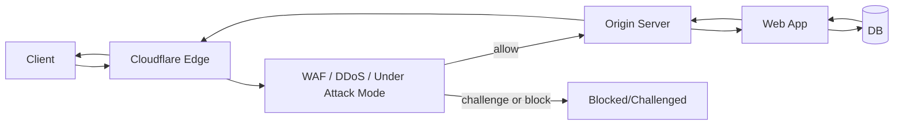
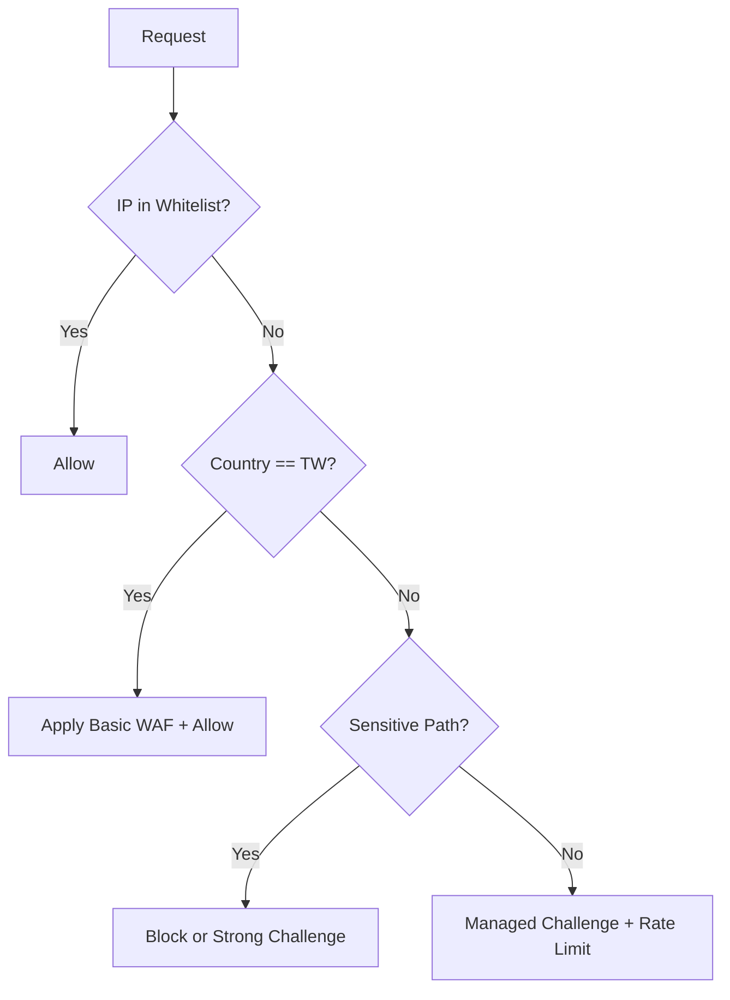

# Cloudflare DNS Proxy 架構下的 DDoS 防護與來源 IP 策略指南

> 適用情境：  
> - 網站 DNS 已託管 Cloudflare  
> - A/AAAA/CNAME 記錄為 **Proxied（橘雲）**  
> - 已開啟 **Under Attack Mode**  
> - 希望盡量不改動既有後端程式碼與服務設定

---

## 1. 先回答核心問題（重點摘要）

1. **可以依來源 IP 開白名單嗎？**  
   可以。可在 Cloudflare WAF / Firewall Rules 設定允許（Allow）特定來源 IP 或 IP range。

2. **可以依來源 IP 區分國內外嗎？**  
   可以。Cloudflare 可依 `ip.geoip.country` 做規則（例如 TW 允許、非 TW 挑戰或封鎖）。

3. **「國內安全、國外不安全」這個策略可行嗎？**  
   技術上可行，但**不建議直接把「全部國外」視為不安全並全面阻擋**。  
   建議：  
   - 國內（TW）：放寬（但仍保留基本 WAF）  
   - 國外：改用 Managed Challenge / Rate Limit，而不是全部 Block  
   - 對敏感路徑（`/login`, `/admin`, `/wp-login.php`）使用更嚴格規則

4. **如何取得真實客戶端 IP？**  
   在 Cloudflare Proxy 下，後端看到的連線來源通常是 Cloudflare。  
   真實客戶端 IP 請讀取：
   - `CF-Connecting-IP`（最常用）
   - `X-Forwarded-For`（可能有多層代理，需正確解析）

5. **盡量不修改原本設定可做到嗎？**  
   可以做到「最小變更」：
   - 不改業務程式碼
   - 優先改 Cloudflare 規則
   - 僅在 Nginx/Apache 加上 real IP 與信任 Cloudflare 來源設定（必要最小調整）

---

## 2. 現況前提與資料流

你目前前提（補充）：
- DNS A/AAAA/CNAME：**Proxied（橘雲）**
- Cloudflare：**Under Attack Mode 已開啟**

在這種模式下流量路徑：



---

## 3. IP 白名單策略（可行且常用）

## 3.1 可放白名單的位置
1. **Cloudflare WAF / Firewall Rules（建議優先）**  
   - 優點：集中管理、立即生效、不改後端
2. Origin 防火牆（次要）  
   - 僅應允許 Cloudflare IP 段存取 80/443  
   - 不建議直接放行外部客戶端 IP 打 Origin（會繞過 Cloudflare）

## 3.2 建議規則順序（很重要）
規則通常由上到下比對，建議順序：

1. **Allow Trusted IP（白名單）**
2. **Allow/Bypass Internal Monitor（若有監控來源）**
3. **Country / ASN / Bot / URI 限制規則**
4. **Managed Challenge**
5. **Block 明確惡意條件**

---

## 4. 用來源 IP 區分國內外：建議做法

## 4.1 不建議的做法
- `國外一律 Block`
  - 風險：誤擋合法使用者、海外員工、CDN 回源服務、第三方 API 回調
  - 也可能被 VPN/代理繞過地理判斷

## 4.2 建議做法（漸進式）
- **國內（TW）**：正常放行 + 基本 WAF
- **國外**：
  - 一般頁面：Managed Challenge
  - 敏感路徑：Block 或 Challenge + Rate Limit
- 若服務明確僅台灣使用，再逐步提高限制強度

## 4.3 範例規則邏輯（概念）
- 規則 A（Allow 白名單）  
  `ip.src in $trusted_ips => Allow`
- 規則 B（國外敏感路徑）  
  `ip.geoip.country ne "TW" and http.request.uri.path contains "/admin" => Block`
- 規則 C（國外一般流量）  
  `ip.geoip.country ne "TW" => Managed Challenge`

---

## 5. 如何取得真實 IP（最小改動方案）

在 Cloudflare Proxy 模式下：

- TCP 連線來源 IP：通常是 Cloudflare 節點
- 真實客戶端 IP：在 HTTP Header 裡（`CF-Connecting-IP`）

## 5.1 Nginx（最小必要設定）
> 目標：不改應用程式程式碼，讓 `$remote_addr` 還原為客戶端 IP（在正確信任來源前提下）

```nginx
# 1) 信任 Cloudflare 反向代理 IP（需填入 Cloudflare 官方 IP ranges）
set_real_ip_from 173.245.48.0/20;
set_real_ip_from 103.21.244.0/22;
# ...其餘 Cloudflare IP ranges

# 2) 指定真實 IP 來源 header
real_ip_header CF-Connecting-IP;

# 3) recursive 可視需求開啟
real_ip_recursive on;
```

> 注意：  
> - `set_real_ip_from` 一定要完整且維護最新，避免偽造 header 風險。  
> - 若你完全不想動 Nginx，也可在應用程式層讀 `CF-Connecting-IP`，但通常仍建議由 Nginx 統一處理。

## 5.2 Apache（最小必要設定）
```apache
# 啟用 mod_remoteip 後
RemoteIPHeader CF-Connecting-IP
RemoteIPTrustedProxy 173.245.48.0/20
RemoteIPTrustedProxy 103.21.244.0/22
# ...其餘 Cloudflare IP ranges
```

---

## 6. 「盡量不增加原本設定」的落地步驟（建議順序）

1. **先只改 Cloudflare（零程式變更）**
   - 開啟 Under Attack Mode（你已完成）
   - 建立 WAF 規則（白名單、國外 challenge、敏感路徑保護）
   - 設定 Rate Limiting（`/login`, `/api`, `/search`）

2. **再做 Origin 最小網路防護**
   - 防火牆只允許 Cloudflare IP 連入 80/443
   - 關閉其他對外不必要端口

3. **最後才做最小伺服器設定**
   - Nginx/Apache real IP 設定（通常只需數行）
   - 驗證 access log 是否看到真實 client IP

---

## 7. Under Attack Mode 的定位（你已啟用）

Under Attack Mode 適合：
- 短期遭受明顯攻擊時快速止血

但它不是唯一策略，建議與以下並用：
- WAF Managed Rules
- 客製 Firewall Rules
- Rate Limiting
- Bot 管理
- Origin 鎖源（只收 Cloudflare）

---

## 8. 風險與誤區（一定要注意）

1. **只靠國別判斷不夠**
   - 攻擊可透過代理/VPN 變換來源地

2. **不要把 Origin IP 暴露出去**
   - 只要 Origin 可被直連，攻擊者就能繞過 Cloudflare

3. **白名單要定期審核**
   - 過期辦公室 IP、供應商 IP 要移除，降低風險面

4. **日誌與告警要同步**
   - Cloudflare Analytics + Origin Logs 一起看，才能正確判斷攻擊型態

---

## 9. 建議的最小可行安全基線（MVP）

- [x] DNS 記錄為 Proxied（橘雲）
- [x] Under Attack Mode（攻擊期間）
- [ ] WAF：OWASP + 基本 managed rules
- [ ] 白名單規則（優先順序最高）
- [ ] 非 TW 流量對敏感路徑 challenge/block
- [ ] `/login` `/api/*` rate limiting
- [ ] Origin 僅允許 Cloudflare IP
- [ ] Nginx/Apache real IP 還原設定
- [ ] 每月檢視規則命中率與誤擋名單

---

## 10. 補充 Mermaid：國內外分流邏輯（策略示意）



---

## 11. 結論

- 你的前提（Proxied + Under Attack Mode）是正確方向。  
- 可以做來源 IP 白名單，也可以做國內外差異化策略。  
- **最關鍵是：Origin 只允許 Cloudflare、並正確還原真實 IP。**  
- 在「盡量不改程式」前提下，主要靠 Cloudflare 規則 + 少量 Nginx/Apache 設定即可達成高比例防護。
