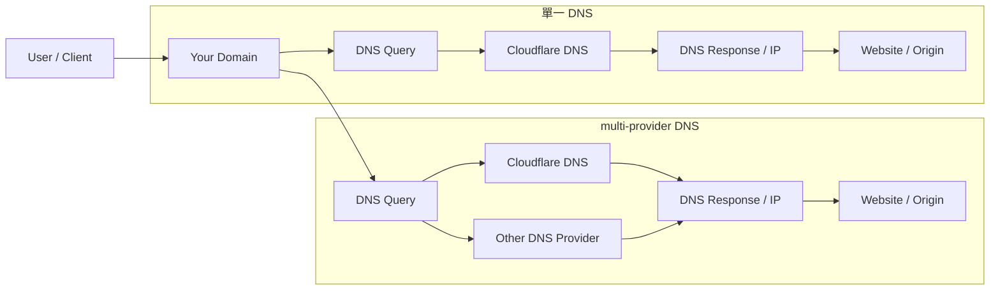

# Cloudflare Multi-provider DNS 說明

這份文件整理了 Cloudflare 文件中提到的 **multi-provider DNS** 功能，並對比 **單一 DNS** 與 **multi-provider DNS** 的差異。

---

## 什麼是 multi-provider DNS？

**Multi-provider DNS（多供應商 DNS）** 是指同一個網域的權威 DNS，可以同時由多個 DNS 供應商提供服務，而不是只依賴單一 DNS 供應商。

這個設計的主要目的，是為了：

- **提高可用性**
- **降低單點故障風險**
- **支援混合型或漸進式 DNS 架構**
- **讓 DNS 遷移過程更平滑**

---

## 什麼時候會用到？

通常在以下情境會考慮使用：

- 你的網域非常重要，不能接受 DNS 單點失效
- 你想把 DNS 從一個供應商逐步移轉到另一個供應商
- 公司已經有多套 DNS 基礎設施，需要共存
- 你希望在一個 DNS 供應商故障時，另一個仍可繼續回應查詢

---

## Cloudflare 文件中的意思

在 Cloudflare 的 nameserver options 文件中，multi-provider DNS 表示：

- Cloudflare 可以和其他 DNS 供應商一起處理同一個 zone
- 這不是一般網站都必須開啟的功能
- 對某些設定來說，這是可選功能
- 對某些 secondary DNS 設定，這是必要行為

你可以把它理解成：

- **單一 DNS**：只有 Cloudflare 負責解析
- **multi-provider DNS**：Cloudflare 與另一家 DNS 供應商共同負責解析

---

## 單一 DNS vs multi-provider DNS

### 單一 DNS

在單一 DNS 架構下，所有 DNS 查詢都只交給同一個供應商處理。

優點：

- 架構簡單
- 設定容易
- 維護成本低

缺點：

- 依賴單一服務商
- 如果該 DNS 服務異常，可能影響整個網域解析

### multi-provider DNS

在 multi-provider DNS 架構下，DNS 查詢可以由多個供應商共同處理。

優點：

- 更高可用性
- 更好的容錯能力
- 更適合關鍵服務

缺點：

- 設定更複雜
- 需要確保不同供應商之間的資料同步
- 維運成本較高

---

## Mermaid 圖示

