# 容器技術架構管理規範與作業程序

> **文件版本：** v1.0
> **建立日期：** 2026-04-30
> **技術基礎：** Rocky Linux 10 / Docker CE / Kubernetes (kubeadm v1.31+)
> **文件分類：** 機密 / 內部使用

---

## 目錄

1. [基礎映像檔管理](#一基礎映像檔管理)
2. [映像檔弱點掃描與風險管理](#二映像檔弱點掃描與風險管理)
3. [容器映像檔登錄管理程序](#三容器映像檔登錄管理程序)
4. [鏡像庫平台存取控管機制](#四鏡像庫平台存取控管機制)
5. [容器技術引入對開發流程的影響](#五容器技術引入對開發流程的影響)
6. [開發部署上線工具與作業程序](#六開發部署上線工具與作業程序)
7. [容器管理平台角色與權限控管](#七容器管理平台角色與權限控管)
8. [容器上線前壓力測試](#八容器上線前壓力測試)
9. [佐證資料清單與產出指引](#九佐證資料清單與產出指引)

---

## 一、基礎映像檔管理

### 1.1 Base Image 來源政策

| 類別 | 說明 |
|------|------|
| **允許來源** | Docker Official Images、Verified Publisher、Red Hat UBI (Rocky Linux 相容)、Google Distroless、Ubuntu Chiseled |
| **禁止來源** | 未驗證第三方映像、個人帳號發布映像、來源不明映像 |
| **驗證方式** | Docker Content Trust (DCT) / Cosign 簽章驗證、SHA256 Digest 固定比對 |
| **優先選擇** | `alpine`、`ubi-minimal`、`ubuntu-chiseled`（.NET 9 多階段建置使用） |
| **CRI 支援** | containerd（符合 Kubernetes CRI 標準） |

### 1.2 Base Image 更新頻率規範

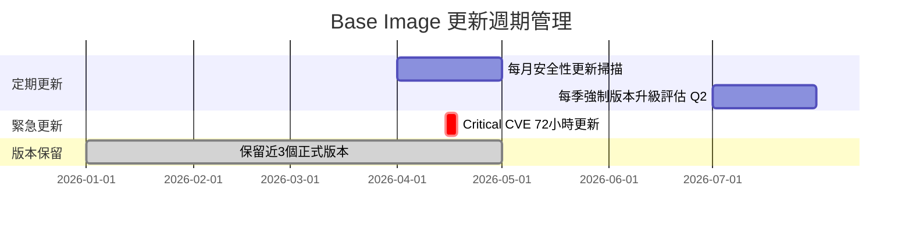

| 更新觸發條件 | 處理時限 | 負責單位 |
|-------------|---------|---------|
| CVE Critical 漏洞公布 | **72 小時內**完成更新及重新建置 | 資安團隊 + DevOps |
| CVE High 漏洞公布 | **7 個工作天內** | DevOps 團隊 |
| CVE Medium 以下 | 每月例行更新週期處理 | DevOps 團隊 |
| 官方 EOL 公告 | 提前 **90 天**啟動遷移計畫 | 架構師 + DevOps |
| 例行定期更新 | 每月第一個週二（Patch Tuesday 對齊） | DevOps 團隊 |

### 1.3 版本保留策略

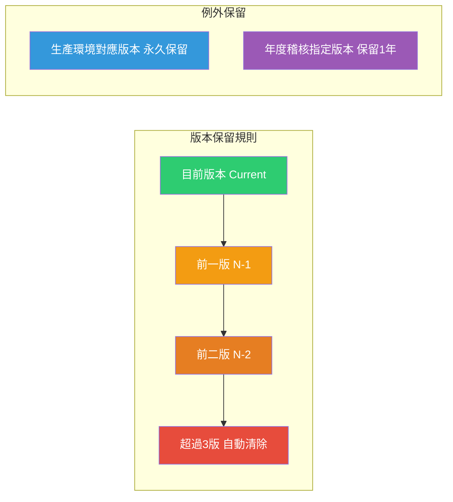

**版本保留數量規範：**

- **Base Image**：保留最近 **3** 個版本
- **Application Image**：保留最近 **5** 個版本
- **生產環境運行版本**：永久保留直至下架後 1 年
- **Release Candidate**：僅保留 **7 天**，測試完畢後清除

---

## 二、映像檔弱點掃描與風險管理

### 2.1 弱點掃描工具架構

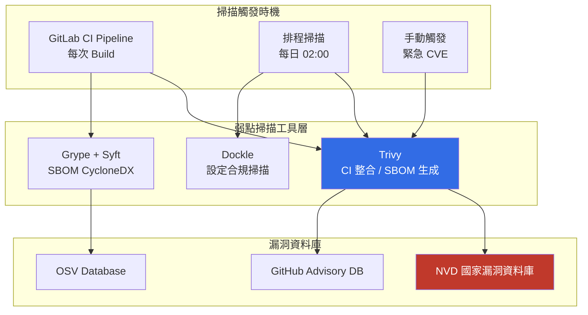

### 2.2 弱點掃描流程與阻斷機制

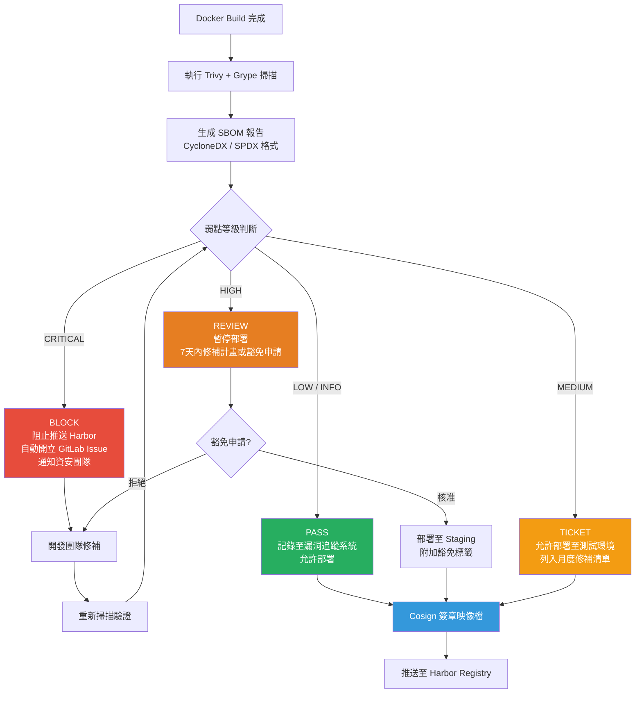

### 2.3 風險評估矩陣

| 嚴重等級 | CVSS 分數 | 處置 SLA | 允許部署環境 | 通知對象 |
|---------|----------|---------|-------------|---------|
| **CRITICAL** | 9.0 – 10.0 | **72 小時** | 全面阻止 | CISO、資安長、架構師 |
| **HIGH** | 7.0 – 8.9 | **7 天** | 限 DEV 環境 | 資安團隊、DevOps Lead |
| **MEDIUM** | 4.0 – 6.9 | **30 天** | DEV + STG | DevOps 團隊 |
| **LOW** | 0.1 – 3.9 | **90 天** | 全環境 | 紀錄留存 |
| **NONE** | 0.0 | 無需處置 | 全環境 | — |

### 2.4 多層防護機制

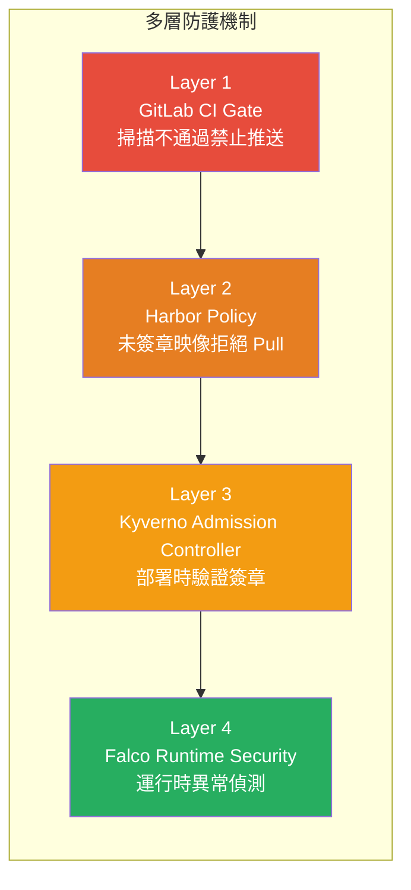

**Kyverno Policy 強制規則：**

- 禁止使用未指定 digest 的 `latest` tag
- 強制驗證 Cosign 簽章
- 禁止 `privileged: true` 容器
- 強制設定 `readOnlyRootFilesystem: true`
- 移除不必要的 Linux Capabilities

---

## 三、容器映像檔登錄管理程序

### 3.1 映像檔生命週期管理流程

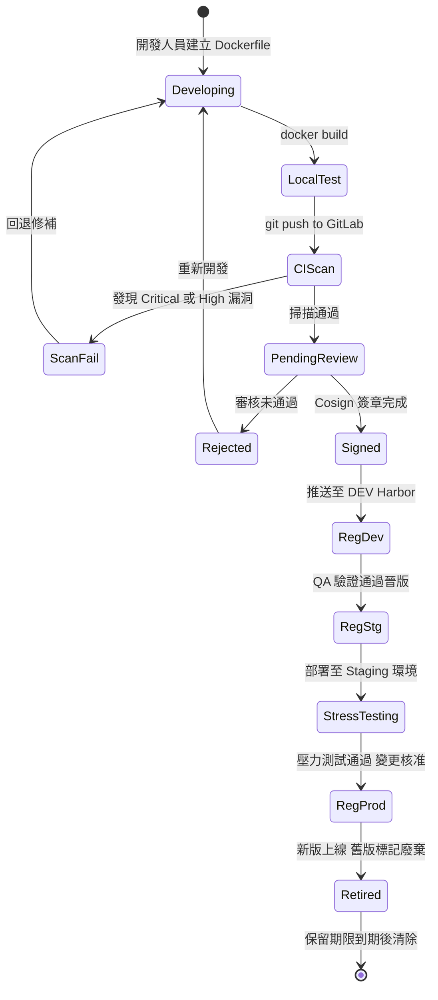

### 3.2 映像檔版本命名規範

```
格式：{harbor-host}/{project}/{image-name}:{major}.{minor}.{patch}-{build-number}

範例：
harbor.internal/backend/api-service:2.3.1-20260430
harbor.internal/frontend/web-portal:1.5.0-20260430
harbor.internal/infra/dotnet9-chiseled:9.0.4-20260428

Tag 規範：
vX.Y.Z-YYYYMMDD  → 正式版本（推送至 PROD Project）
vX.Y.Z-rc.N      → 候選版本（僅限 STG）
vX.Y.Z-dev.N     → 開發版本（僅限 DEV）
latest           → 禁止在 PROD 環境使用
```

### 3.3 映像檔登錄作業程序

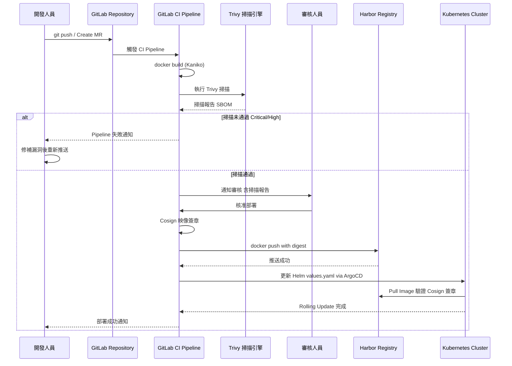

### 3.4 映像檔登錄管理紀錄欄位規範

| 欄位 | 說明 | 範例 |
|------|------|------|
| 映像名稱 | 完整 Harbor image path | `harbor.internal/backend/api:2.3.1` |
| SHA256 Digest | 不可竄改的唯一識別 | `sha256:abc123...` |
| 建置時間 | GitLab CI Pipeline 完成時間 | `2026-04-30T14:30:00+08:00` |
| 建置人員 | CI Service Account | `gitlab-ci-bot` |
| 基底映像 | Base image + digest | `ubi-minimal:9.4@sha256:xyz...` |
| 掃描結果 | 各等級漏洞數量 | `C:0 H:0 M:3 L:12` |
| 掃描工具版本 | 確保可重現性 | `trivy:0.51.0` |
| 簽章狀態 | Cosign 驗證狀態 | `SIGNED / UNSIGNED` |
| 部署環境 | 允許部署的環境 | `DEV / STG / PROD` |
| 核准人員 | 審核通過的負責人 | `arch-lead@internal` |

---

## 四、鏡像庫平台存取控管機制

### 4.1 Harbor Registry 架構設計

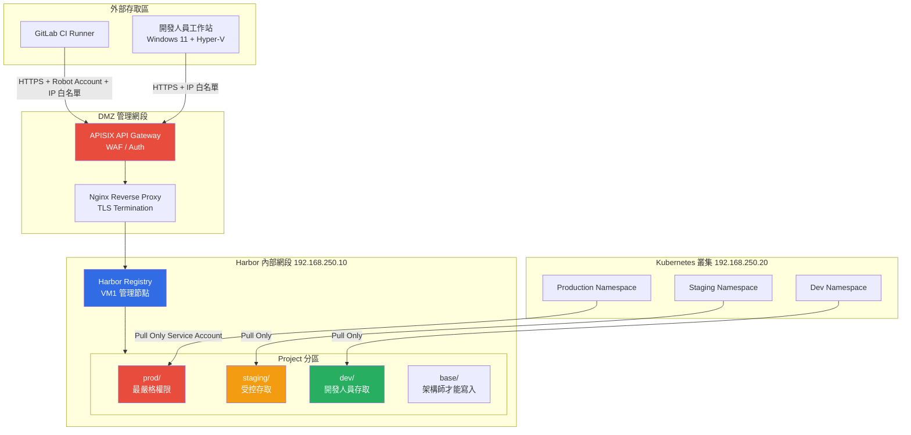

### 4.2 存取控管機制

**IP 白名單規則**

| 來源 | 允許存取 Project | 存取類型 |
|------|----------------|---------|
| 辦公室 VPN / Hyper-V 管理網段 | dev/、staging/ | Push / Pull |
| GitLab CI Runner 固定 IP | 全部 Project | Push（Robot Account） |
| Kubernetes Node IP（192.168.250.20） | 對應環境 Project | Pull Only |
| 管理員跳板機 IP | 全部含 prod/base | 管理操作 |
| 其他 IP | 全部拒絕 | — |

**帳號權限矩陣（Harbor RBAC）**

| 角色 | base/ | prod/ | staging/ | dev/ | 系統管理 |
|------|-------|-------|----------|------|---------|
| **系統管理員** | R/W | R/W | R/W | R/W | 是 |
| **資深架構師** | R/W | R | R/W | R/W | 否 |
| **DevOps 工程師** | R | R | R/W | R/W | 否 |
| **開發人員** | R | 無 | R | R/W | 否 |
| **CI Robot Account** | R/W | R/W | R/W | R/W | 否 |
| **K8S Service Account** | R | R（對應環境）| R | R | 否 |
| **稽核帳號** | R 唯讀 | R 唯讀 | R 唯讀 | R 唯讀 | 否 |

> R = Read (Pull)、W = Write (Push)

### 4.3 安全稽核與監控

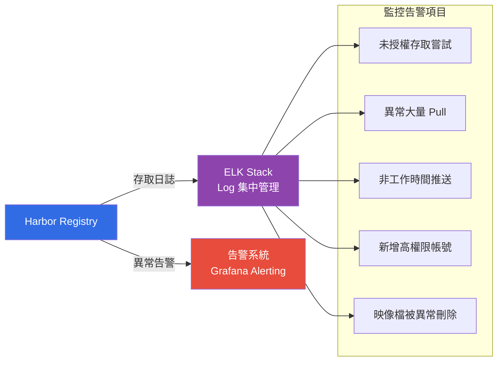

---

## 五、容器技術引入對開發流程的影響

### 5.1 開發流程對比

```mermaid
graph TB
    subgraph BEFORE[傳統部署流程 導入前]
        B1["程式開發"] --> B2["打包 WAR/JAR"]
        B2 --> B3["上傳至 AP Server"]
        B3 --> B4["手動修改設定"]
        B4 --> B5["重啟服務"]
        B5 --> B6["人工驗證"]
    end
    subgraph AFTER[容器化流程 導入後]
        A1["程式開發"] --> A2["Dockerfile 撰寫\n支援 Multi-stage .NET 9"]
        A2 --> A3["GitLab CI Build + Trivy 掃描"]
        A3 --> A4["Image Push to Harbor"]
        A4 --> A5["ArgoCD 自動同步"]
        A5 --> A6["K8s Rolling Update\ncontainerd CRI"]
        A6 --> A7["Prometheus 健康監控"]
    end
```

### 5.2 系統更新修補程序（容器化版本）

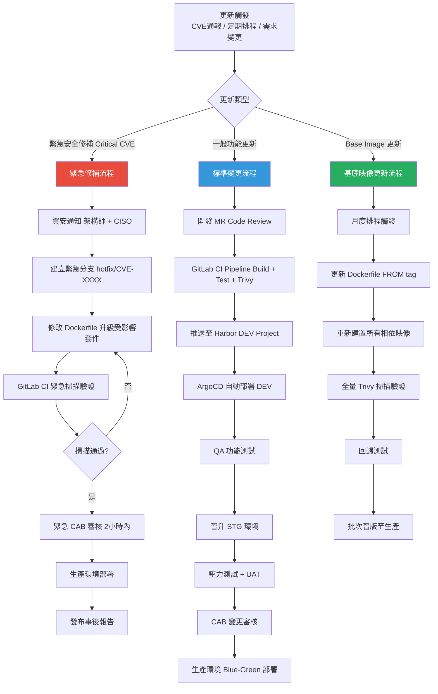

---

## 六、開發部署上線工具與作業程序

### 6.1 工具鏈架構圖

```mermaid
graph TB
    subgraph DEV_TOOLS[開發工具層]
        IDE["VS Code / Rider\n+ Docker Extension"]
        DOCKERFILE["Dockerfile\nMulti-stage .NET 9\nUbuntu Chiseled"]
        GIT2["GitLab Repository\n192.168.250.10"]
    end
    subgraph CI_TOOLS[CI/CD 工具層]
        GITLAB_CI["GitLab CI\n.gitlab-ci.yml"]
        KANIKO["Kaniko\n無 Docker Daemon 建置"]
        TRIVY3["Trivy 掃描\nSBOM 生成"]
        COSIGN2["Cosign 簽章"]
        ANSIBLE2["Ansible Playbook\n自動化組態管理"]
    end
    subgraph REGISTRY_TOOLS[Registry 工具層]
        HARBOR3["Harbor Registry\nVM1 192.168.250.10"]
        NOTARY2["Notary V2\n信任管理"]
    end
    subgraph DEPLOY_TOOLS[部署工具層]
        ARGO2["ArgoCD GitOps"]
        HELM2["Helm Charts\nK8s 套件管理"]
        KUSTOMIZE2["Kustomize\n環境差異化設定"]
        METALB["MetalLB\nL4 Load Balancer"]
        VAULT["Vault + ESO\n機密管理"]
    end
    subgraph RUNTIME2[執行環境]
        K8S4["Kubernetes kubeadm v1.31+\nVM2 192.168.250.20"]
        CONTAINERD["containerd CRI"]
        CILIUM["Cilium eBPF CNI\nIdentity-based 安全"]
        KYVERNO2["Kyverno Policy Engine"]
        FALCO2["Falco Runtime Security"]
    end
    subgraph OBS2[可觀測性]
        PROM2["Prometheus + Grafana\nTCP BBR 效能監控"]
        ELK2["ELK Stack\nLog 集中管理"]
        VELERO["Velero DR/Backup"]
    end
    DEV_TOOLS --> CI_TOOLS
    CI_TOOLS --> REGISTRY_TOOLS
    REGISTRY_TOOLS --> DEPLOY_TOOLS
    DEPLOY_TOOLS --> RUNTIME2
    RUNTIME2 --> OBS2
    style HARBOR3 fill:#326ce5,color:#fff
    style K8S4 fill:#326ce5,color:#fff
    style ARGO2 fill:#ef7b4d,color:#fff
    style CILIUM fill:#f5a623,color:#fff
    style FALCO2 fill:#00b4c8,color:#fff
```

### 6.2 GitOps 部署作業程序

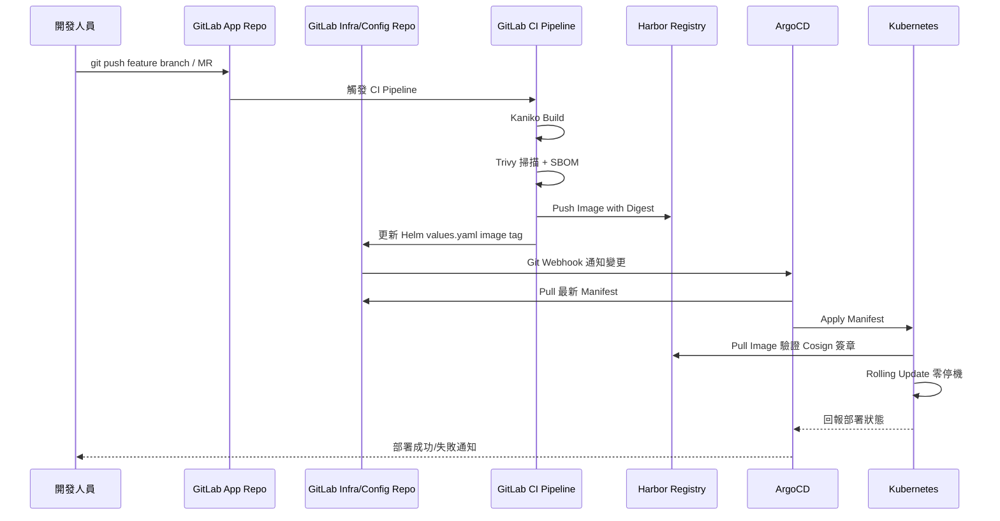

### 6.3 環境晉升程序

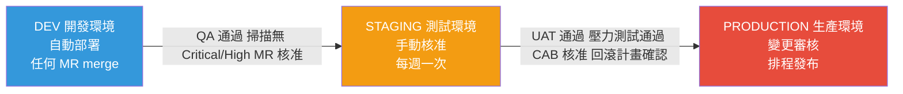

---

## 七、容器管理平台角色與權限控管

### 7.1 Kubernetes RBAC 角色架構

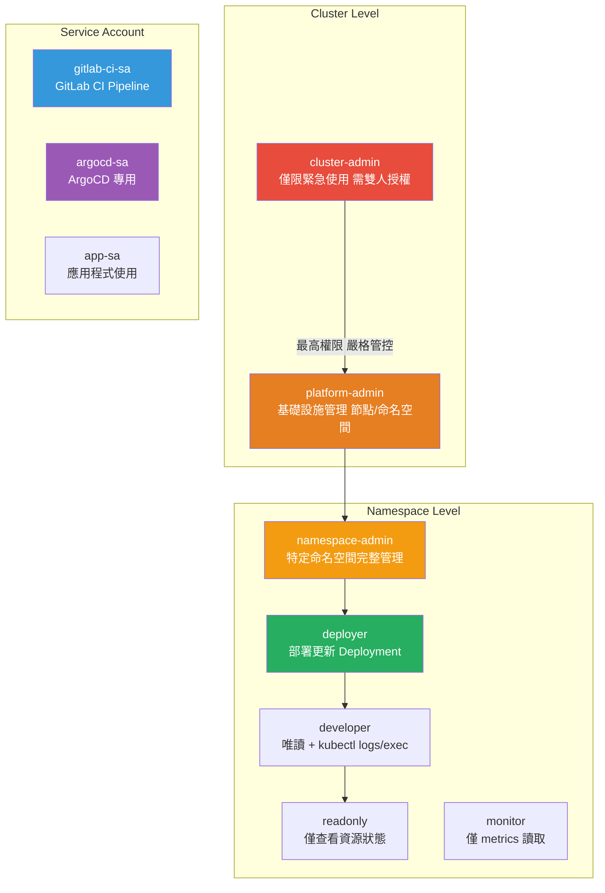

### 7.2 各角色權限明細

| 角色 | Pods | Deployments | Services | Secrets | ConfigMaps | Nodes | Namespaces |
|------|------|-------------|----------|---------|------------|-------|------------|
| **cluster-admin** | CRUD | CRUD | CRUD | CRUD | CRUD | CRUD | CRUD |
| **platform-admin** | CRUD | CRUD | CRUD | R | CRUD | R | CRUD |
| **namespace-admin** | CRUD | CRUD | CRUD | CRUD | CRUD | — | — |
| **deployer** | R/D | R/U | R | — | R/U | — | — |
| **developer** | R/Exec | R | R | — | R | — | — |
| **readonly** | R | R | R | — | R | — | — |
| **gitlab-ci-sa** | CRUD | R/U | R | — | R/U | — | — |

> CRUD = Create/Read/Update/Delete、R = Read Only、U = Update、D = Delete

### 7.3 特權存取管理流程

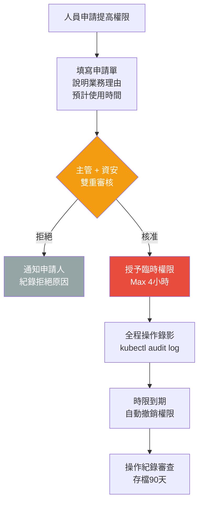

### 7.4 Kubernetes 安全基準設定（CIS Benchmark）

依據 **CIS Kubernetes Benchmark** 及 **NSA Kubernetes Hardening Guide** 進行設定：

| 設定項目 | 設定值 | 說明 |
|---------|-------|------|
| API Server 匿名認證 | `--anonymous-auth=false` | 禁止匿名存取 |
| RBAC 授權模式 | `--authorization-mode=RBAC,Node` | 啟用 RBAC |
| Audit Log | `--audit-log-path=/var/log/audit.log` | 完整稽核日誌 |
| etcd 加密 | `--encryption-provider-config` | Secret 靜態加密 |
| Pod Security Standards | `Restricted` mode（PROD） | 限制特權容器 |
| Network Policy | Default Deny All（Cilium eBPF） | 最小網路存取原則 |
| Kubelet 匿名認證 | `authentication.anonymous.enabled=false` | 禁止匿名存取 |
| TCP BBR | `net.core.default_qdisc=fq` | 核心效能優化 |
| Vault + ESO | External Secrets Operator | 機密不落地 K8s Secret |

---

## 八、容器上線前壓力測試

### 8.1 壓力測試流程

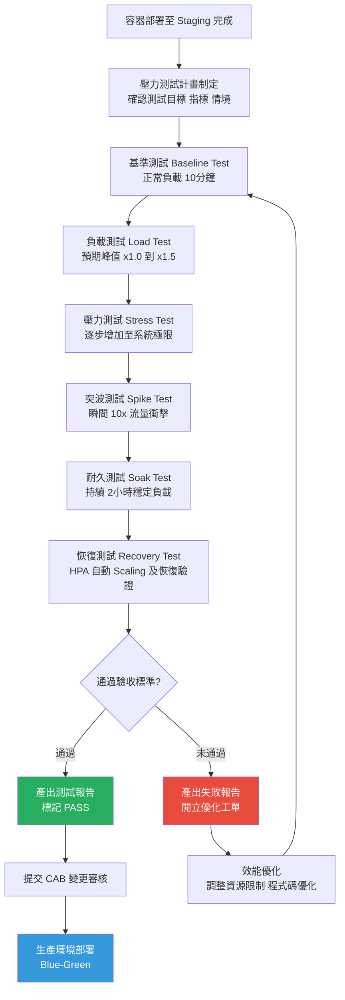

### 8.2 壓力測試工具與指標

| 測試類型 | 使用工具 | 關鍵指標 |
|---------|---------|---------|
| HTTP 負載測試 | **k6** / **Locust** | RPS、P95/P99 Latency、Error Rate |
| API 壓力測試 | **JMeter** / **Gatling** | Throughput、Response Time |
| 容器資源壓力 | **stress-ng** | CPU / Memory / Network 使用率 |
| Kubernetes 擴展測試 | **kube-burner** | HPA 觸發時間、Pod 啟動時間 |
| 網路效能測試 | **iperf3**（Cilium eBPF 驗證） | 封包遺失率、頻寬 |

### 8.3 驗收標準（Production Gate Criteria）

| 指標 | 驗收標準 | 量測方式 |
|------|---------|---------|
| 回應時間 P95 | **< 500ms** | k6 metrics |
| 回應時間 P99 | **< 1,000ms** | k6 metrics |
| 錯誤率 | **< 0.1%** | HTTP 5xx / Total |
| CPU 使用率（峰值） | **< 80%** | Prometheus |
| Memory 使用率（峰值） | **< 85%** | Prometheus |
| HPA 擴展觸發時間 | **< 60 秒** | Kubernetes Event |
| Pod 啟動時間（containerd） | **< 30 秒** | kubectl rollout |
| 服務可用性（Soak Test） | **> 99.9%** | Uptime 監控 |

### 8.4 壓力測試紀錄表單範例

```
測試報告編號：PT-2026-0430-001
測試日期：2026-04-30
測試環境：Staging K8S Node (VM2 192.168.250.20)
          4 vCPU, 4GB RAM, containerd CRI, Cilium CNI
測試對象：harbor.internal/backend/api-service:2.3.1-20260430
測試工具：k6 v0.50.0 + Grafana Dashboard

測試結果摘要：
┌────────────────────────────────────────────────┐
│ 指標              │ 結果      │ 標準     │ 狀態 │
├────────────────────────────────────────────────┤
│ P95 Latency       │ 312ms     │ <500ms   │  PASS │
│ P99 Latency       │ 748ms     │ <1000ms  │  PASS │
│ Error Rate        │ 0.02%     │ <0.1%    │  PASS │
│ Peak CPU          │ 72%       │ <80%     │  PASS │
│ Peak Memory       │ 68%       │ <85%     │  PASS │
│ HPA Scale Time    │ 45s       │ <60s     │  PASS │
│ Soak Availability │ 99.96%    │ >99.9%   │  PASS │
└────────────────────────────────────────────────┘

結論：通過所有驗收標準，核准晉升至生產環境
核准人員：[架構師簽名]  日期：2026-04-30
```

---

## 九、佐證資料清單與產出指引

### 9.1 佐證資料對應表

| # | 佐證資料 | 負責單位 | 產出頻率 | 保存年限 |
|---|---------|---------|---------|---------|
| 1 | Base Image 版本清單及官方最新版對比表 | DevOps | 每月 | 3 年 |
| 2 | Trivy 工具設定文件及 GitLab CI 整合說明 | 資安 + DevOps | 版本變更時 | 5 年 |
| 3 | 弱點掃描報告（近一年，含 SBOM） | 資安 | 每次掃描 | 3 年 |
| 4 | 弱點風險評估及修補紀錄（GitLab Issues） | 資安 | 有漏洞時 | 3 年 |
| 5 | 容器映像檔版本管控規範（本文件） | 架構師 | 年度審查 | 永久 |
| 6 | Harbor 映像檔登錄管理程序及維護紀錄 | DevOps | 每次操作 | 3 年 |
| 7 | Harbor 帳號權限清單（季度審查截圖） | 資安 + DevOps | 季度 | 3 年 |
| 8 | Harbor 存取日誌 + ELK 異常事件報告 | 資安 | 持續 | 1 年 |
| 9 | k6 壓力測試報告（每次上線前） | QA + DevOps | 每次部署 | 3 年 |
| 10 | Kubernetes RBAC 設定及 Kyverno Policy 紀錄 | DevOps | 每次變更 | 3 年 |
| 11 | CAB 變更審核紀錄 | 變更管理 | 每次變更 | 5 年 |
| 12 | CIS Kubernetes Benchmark 稽核報告 | 資安 | 季度 | 3 年 |
| 13 | Velero 備份驗證及 DR 演練紀錄 | DevOps | 每月 | 3 年 |

### 9.2 年度稽核準備索引

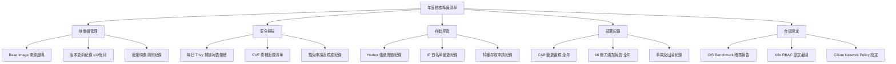

---

## 附錄：技術選型對照表

| 類別 | 工具 / 技術 | 版本基準 | 用途 |
|------|------------|---------|------|
| 作業系統 | Rocky Linux | 10 | 容器宿主機 |
| 虛擬化 | Hyper-V | Windows 11 | 實驗室環境 |
| 容器執行環境 | Docker CE + containerd | Latest Stable | 開發 + K8s CRI |
| 映像庫 | Harbor | 2.x | 私有 Registry |
| CI/CD | GitLab CE | Latest | Pipeline |
| 容器建置 | Kaniko | Latest | 無特權建置 |
| 安全掃描 | Trivy | 0.51+ | CVE/SBOM 掃描 |
| 運行時安全 | Falco | Latest | 異常偵測 |
| 映像簽章 | Cosign | Latest | 供應鏈安全 |
| 編排平台 | Kubernetes (kubeadm) | v1.31+ | 容器編排 |
| CNI | Cilium (eBPF) | Latest | 網路 + 安全 |
| LB | MetalLB | Latest | L4 負載平衡 |
| GitOps | ArgoCD | Latest | 自動化部署 |
| Policy | Kyverno | Latest | 准入控制 |
| API Gateway | APISIX | Latest | WAF / Auth |
| 機密管理 | Vault + ESO | Latest | 憑證管理 |
| 備份 DR | Velero | Latest | 容災備份 |
| 自動化 | Ansible | core | 組態管理 |
| 效能優化 | TCP BBR | Kernel 內建 | 網路吞吐量 |

---

> **文件審查週期：** 每年一次定期審查，或重大架構變更時立即更新
> **下次審查日期：** 2027-04-30
> **參考專案：** [enterprise-containerization-cases](https://github.com/tedtv1007-ctrl/enterprise-containerization-cases)
> **參考標準：** CIS Docker Benchmark / CIS Kubernetes Benchmark / NIST SP 800-190 / NSA Kubernetes Hardening Guide / SLSA Supply Chain Security